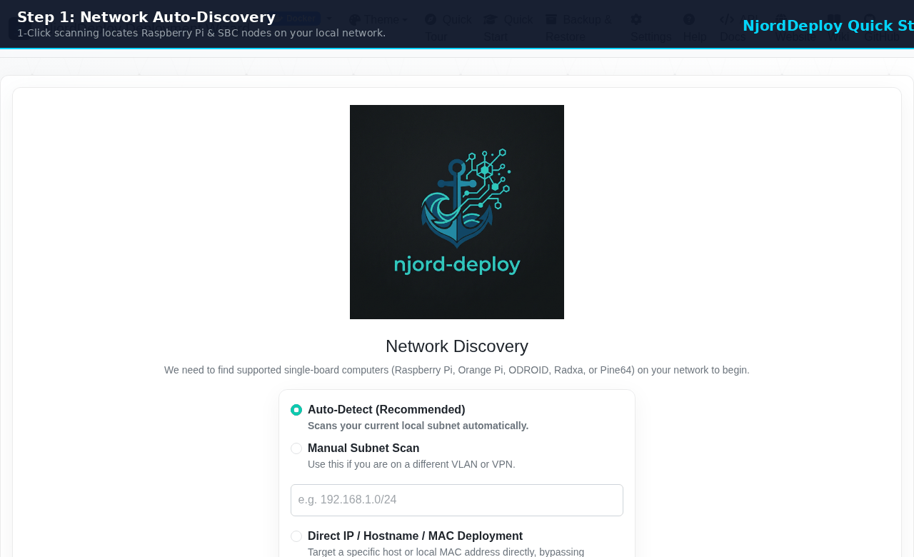

<div align="center">
  

  # NjordDeploy

  **Sovereign Self-Hosting Engine & AI Component Studio**

  [](https://github.com/HenkVanHoek/njord-deploy/releases)
  [](LICENSE)
  [](pyproject.toml)
  [](docs/CONTAINER_ENGINE_AND_REPO_ARCHITECTURE.md)
  [](https://njorddeploy.com)
  [](docs/SUPPORTED_SERVICES.md)

  <p align="center">
    Deploy 100+ verified, privacy-first applications to any Raspberry Pi, Proxmox VM, or Linux server in minutes.<br>
    Zero cloud lock-in, transactional disaster recovery, and an AI-assisted component studio.
  </p>

  <p align="center">
    <a href="https://njorddeploy.com"><strong>Website</strong></a> •
    <a href="docs/GETTING_STARTED_FOR_BEGINNERS.md"><strong>Quick Start Guide</strong></a> •
    <a href="docs/SUPPORTED_SERVICES.md"><strong>100+ App Catalog</strong></a> •
    <a href="docs/ARCHITECTURE.md"><strong>Architecture</strong></a> •
    <a href="docs/API_REFERENCE.md"><strong>REST API</strong></a> •
    <a href="https://github.com/HenkVanHoek/njord-deploy/releases"><strong>Releases</strong></a>
  </p>
</div>

---

<div align="center">
  <a href="docs/GETTING_STARTED_FOR_BEGINNERS.md">
    
  </a>
  <p>
    <strong>🐣 New to self-hosting?</strong> Check out our <strong><a href="docs/GETTING_STARTED_FOR_BEGINNERS.md">Beginner's Guide (Quick Start for Dummies)</a></strong> to get up and running in 5 minutes!
  </p>
</div>

---

## 🌟 Key Highlights

* **100+ Verified Sovereign Stacks**: Deploy pre-tested applications spanning AI/LLMs (Ollama, Open WebUI, LiteLLM), Cloud Storage (Immich, Nextcloud, Syncthing, MinIO), Home Automation (Home Assistant, ESPHome, Zigbee2MQTT), Security (Vaultwarden, AdGuard Home, Traefik, CrowdSec), and Media (Jellyfin, Plex, Audiobookshelf) (see [Supported Services Catalog](docs/SUPPORTED_SERVICES.md)).
* **1-Click Turnkey Bundles & Stacks**: Instant, single-click deployment presets for MSPs (*Modern Workplace*, *Digital Archive & Compliance*, *Agile Operations*, *Observability*) and Homelabs (*AI Studio*, *Media Suite*, *Smart Home*, *DNS Shield*) with zero port collisions and automated companion dependency wiring.
* **Zero Target Host Footprint**: Connects over agentless SSH. Does **not** require or install Python, compilers, or background agent daemons on the target machine.
* **Dual-Engine Architecture (Docker & Rootless Podman)**: Universal container abstraction supporting standard Docker CE and unprivileged Rootless Podman with automatic low-port kernel mapping (`net.ipv4.ip_unprivileged_port_start=53`) and user session lingering.
* **AI Component Studio**: Convert any public or self-hosted Git repository (**GitHub, GitLab, Gitea, Forgejo, Codeberg, Bitbucket**) into a validated Jinja2 Compose stack powered by local offline Ollama models, EU sovereign Loes.ai / HostYourAI, Google Gemini, or OpenAI (see [Developer AI Guide](docs/DEVELOPER_AI_AND_SYNC_GUIDE.md)).
* **Transactional Disaster Recovery**: Point-in-time state backups for all managed persistent volumes and databases with container-safe volume pausing, SHA-256 integrity checksums, and single-click restoration.
* **Proxmox 4-Way Cross-Validation & PDF Reporting**: Automated hypervisor matrix testing across 4 quadrants (Docker vs Podman × LXC vs VM) with autonomous AI log diagnostics, local pull-through registry caching, and 1-click A4 vector PDF export with embedded visual proofs (see [Testing Strategy](docs/TESTING_STRATEGY.md) and [Self-Healing DevOps Case Study](docs/CASE_STUDY_SELF_HEALING_DEVOPS.md)).
* **Headless REST API & Interactive Swagger UI**: Complete OpenAPI 3.0 REST engine for CI/CD automation, homelab scripting, and AI coding agents (see [API Reference](docs/API_REFERENCE.md)).

---

## 🎯 Tailored Solutions

| Audience | Use Case | Key Benefits |
| :--- | :--- | :--- |
| 🏠 **Homelab & Privacy** | Private Home Servers & SBCs | 100+ one-click apps, automatic L2 subnet scanning, 1-click web dashboards, zero terminal friction. |
| ⚡ **Developers & DevOps** | Custom Stacks & CI/CD Pipelines | AI Component Studio (Git-to-Compose), Dual Docker/Podman engines, Headless REST API & CLI. |
| 🏢 **MSPs & IT Consultants** | Turnkey Private Cloud on Proxmox | Standardized 15-min deployments, Dual-Layer Disaster Recovery (PBS + Volume state), 100% GDPR & NIS2 compliant. |

---

## 🚀 Quick Start Guide

### Mode A: Standalone Desktop Application (Windows, macOS, Linux)

1. **Download the Release**: Grab the portable package for your OS from the [GitHub Releases Page](https://github.com/HenkVanHoek/njord-deploy/releases):
   * `NjordDeploy-Linux.zip`
   * `NjordDeploy-macOS.zip`
   * `NjordDeploy-Windows.zip`
2. **Unzip & Launch**:
   * **`NjordDeployConfigurator`** (`.exe` on Windows): Guided end-user deployment wizard (runs on `http://localhost:5001`).
   * **`NjordDeployEditor`** (`.exe` on Windows): Developer tool for creating and modifying component metadata (runs on `http://localhost:5000`).
   * **`NjordDeployProxmoxTest`** (`.exe` on Windows): Automated Proxmox VE hypervisor test matrix suite (runs on `http://localhost:5050`).
3. **Follow the On-Screen Wizard**: Auto-discover your device on the local network, pick your software stacks, customize variables, and deploy with real-time browser log streaming.

> [!NOTE]
> **Linux Desktop Users**: Grant the local scanner permission for L2 network discovery:
> ```bash
> echo "$USER ALL=(ALL) NOPASSWD: /usr/bin/nmap" | sudo tee /etc/sudoers.d/99-njorddeploy
> sudo chmod 0440 /etc/sudoers.d/99-njorddeploy
> ```

---

### Mode B: 24/7 Persistent Self-Hosted Service Daemon

Run NjordDeploy continuously on your server, mini-PC, or Proxmox VM:

- **Via Docker Compose:**
  ```bash
  docker compose up -d
  curl -s http://localhost:5001/api/health
  ```
- **Via Native Linux Systemd:**
  ```bash
  sudo ./scripts/install_systemd_service.sh install
  sudo ./scripts/install_systemd_service.sh status
  ```

For full persistent SSH key setup, reverse proxy integration, and environment options, see the **[24/7 Self-Hosted Service Guide](docs/SELF_HOSTED_SERVICE_GUIDE.md)**.

---

## 🏛️ System Requirements & Runtime Policy

### Machine Running the Installer:
* **Operating System**: Windows, macOS, or Linux.
* **Linux Prerequisites**: `sudo apt install -y nmap sshpass openssh-client`

### Target Server (e.g. Raspberry Pi, Proxmox VM, Linux server):
* **Hardware**: Raspberry Pi 4/5, Orange Pi, Rock Pi, mini PC, x86_64 server, or Proxmox LXC/VM.
* **Operating System**: Debian 12 (Bookworm), Ubuntu 22.04/24.04, or Raspberry Pi OS.
* **Container Runtime**: Docker Engine (with Compose plugin) or Rootless Podman (with `podman-compose`). NjordDeploy can automatically install and configure either during setup.
* **Host Runtime Policy**: No Python interpreter or compiler is installed on the target host. All operational and automation dependencies run strictly inside containers.

---

## 📁 Repository Structure

```
.
├── ansible/                  # Agentless provisioning playbooks
├── component_templates/      # 100+ modular Docker/Podman service templates
├── config/                   # Single Source of Truth (components_metadata.json)
├── docs/                     # Architectural specs, API references, and user guides
├── linux/                    # Linux desktop launcher and install scripts
├── scripts/                  # Proxmox test runners, fetch assets, daemon installers
├── src/
│   ├── configurator_app/     # End-user web wizard and OpenAPI Swagger server
│   ├── editor_app/           # Developer component studio and AI generator
│   ├── managers/             # Core orchestrators (deployment, ssh, sync, backup)
│   ├── node_scanner.py       # L2 ARP & subnet discovery engine
│   └── utils/                # AI failure diagnoser, container engines, Proxmox client
├── tests/                    # Comprehensive unit, integration, and Playwright tests
└── pyproject.toml            # Project configuration and dependency lock
```

---

## 📚 In-Depth Documentation & Case Studies

* **[Beginner's Quick Start Guide](docs/GETTING_STARTED_FOR_BEGINNERS.md)**: Visual step-by-step onboarding for Raspberry Pi newcomers.
* **[100% Local AI & Deterministic IaC](docs/CASE_STUDY_LOCAL_AI_SOVEREIGNTY.md)**: Zero-cloud AI component scaffolding with Ollama.
* **[Self-Healing DevOps Case Study](docs/CASE_STUDY_SELF_HEALING_DEVOPS.md)**: Proxmox 4-way cross-validation and automated diff patching.
* **[Building a Sovereign Home Server (DEV.to)](https://dev.to/henk_van_hoek/building-a-sovereign-home-server-lessons-learned-running-nextcloud-euro-office-and-frigate-on-a-1kbc)**: Real-world Raspberry Pi 5 hardware benchmarks ([local summary](docs/sovereign_home_server.md)).
* **[REST API Reference & Swagger UI](docs/API_REFERENCE.md)**: Programmatic automation for AI agents and CI/CD.

---

## 🤝 Contributing

Contributions are welcome! Please review [ARCHITECTURE.md](docs/ARCHITECTURE.md) and [DATA_CONTRACTS.md](docs/DATA_CONTRACTS.md) to understand the core design principles and Single Source of Truth metadata contracts.

---

## 📄 License

This project is licensed under the **[Business Source License 1.1 (BSL-1.1)](LICENSE)**:
* **100% Free for Self-Hosting**: Free for personal homelabs, hobbyists, and managing up to two (2) self-hosted target server nodes without a commercial subscription.
* **Automatic Open Source Transition**: Transitions unconditionally to the standard **Apache 2.0 License** two years after release.
* **Commercial / MSP Licensing**: Commercial platforms and MSP fleet management tiers require a commercial license or active subscription via the [Customer Portal](https://billing.stripe.com/p/login/00w28r5tw9E3goC9W91Nu00).

Copyright (c) 2025-2026 Henk van Hoek. All rights reserved.
