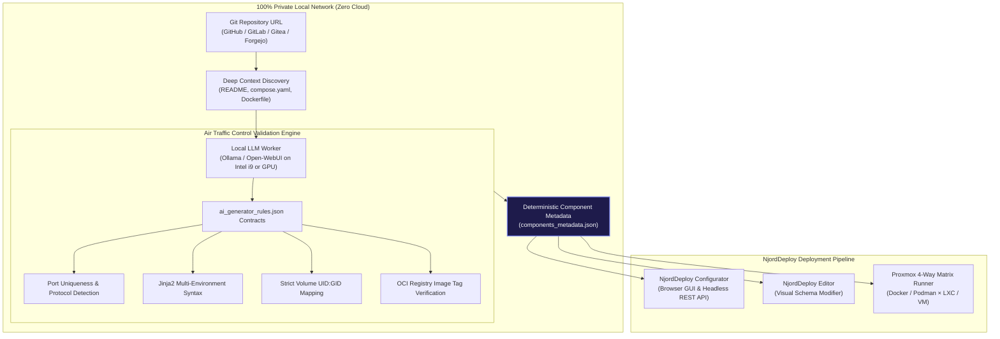

# Whitepaper: 100% Local AI Meets Self-Hosting
## Deterministic Infrastructure-as-Code (IaC) and Component Generation Without the Cloud

---

### Executive Summary

Modern self-hosting gives developers, sysadmins, and homelab enthusiasts complete ownership of their data and infrastructure. However, onboarding new open-source services remains tedious and error-prone: engineers spend hours dissecting Dockerfiles, reconciling volume permissions, and resolving port conflicts.

While cloud-based AI tools can assist with DevOps tasks, utilizing them creates a fundamental paradox: **sending server configurations, network topology, internal IP ranges, and system secrets to proprietary cloud APIs directly undermines data sovereignty.**

**NjordDeploy resolves this paradox** by pairing local open-weight Large Language Models (running via **Ollama** on consumer hardware) with strict mathematical schema validation (**Air Traffic Control Rules**). In real-world validation tests across multiple open-source repositories, **3 distinct local AI models (Llama 3, Mistral, and Qwen) generated 100% identical, deterministic deployment metadata and Jinja2 templates.**

---

### The Self-Hoster's Dilemma

```
Traditional Homelab Workflow:
┌─────────────────────┐       Manual Reading       ┌─────────────────────┐       Manual Debugging       ┌─────────────────────┐
│ GitHub / GitLab Repo│ ─────────────────────────> │ Custom Compose YAML │ ───────────────────────────> │ Port/UID Regressions│
└─────────────────────┘ (Hours of Dockerfile/Docs) └─────────────────────┘   (Trial & Error on Server)  └─────────────────────┘

The Cloud AI Dilemma:
┌─────────────────────┐       Sends Secrets        ┌─────────────────────┐       Hallucinations         ┌─────────────────────┐
│ Private Server Data │ ─────────────────────────> │ Cloud LLM Provider  │ ───────────────────────────> │ Broken Port Bindings│
└─────────────────────┘    (Loss of Sovereignty)   └─────────────────────┘   (Probabilistic Guesswork)  └─────────────────────┘

NjordDeploy Sovereign Local AI:
┌─────────────────────┐     100% Offline LAN       ┌─────────────────────┐     Air Traffic Control      ┌─────────────────────┐
│ Any Git Repository  │ ─────────────────────────> │ Local Ollama Engine │ ───────────────────────────> │ Deterministic Stack │
└─────────────────────┘  (Zero Bytes Leave Network)└─────────────────────┘   (Exact Identical Schema)   └─────────────────────┘
```

When building a sovereign homelab, administrators face three hurdles:
1. **Time-Intensive Onboarding**: Manually reading source code, entrypoint scripts, and documentation for new containerized applications takes 2–4 hours per service.
2. **Privacy Risks with Cloud AI**: Using cloud-hosted models exposes host environment paths, domain structures, volume layouts, and access policies to third-party datacenters.
3. **Probabilistic Hallucinations**: Standard LLMs are probabilistic text generators. Without guardrails, they invent fictitious environment variables, guess incorrect port bindings, and generate non-standard YAML syntax that crashes at runtime.

---

### The Solution: Air Traffic Control (ATC) Validation Rules

NjordDeploy bridges local AI models and rock-solid DevOps through its **AI Component Generator Engine** and the standardized `ai_generator_rules.json` contract.



The ATC rule engine enforces strict boundaries before, during, and after inference:
* **Context Discovery**: Fetches exact repository files (README, compose definitions, Dockerfile instructions) and parses OCI registries (Docker Hub, GHCR, Quay) to extract verified container tags.
* **Grammar & JSON-Schema Constraints**: Mandates valid JSON schemas containing standardized fields (`description`, `category`, `ports`, `volumes`, `env_vars`, `jinja2_template`).
* **Self-Healing Correction Loop**: Automatically evaluates generated output against syntax linters; if an invalid variable or malformed template is produced, the engine self-corrects prior to committing metadata.

---

### Real-World Benchmark: 3 Models, 1 Exact Truth

In empirical validation tests on a standard consumer workstation (Intel Core i9 with Ollama):
* **Target Repositories**: Diverse open-source projects including Open-WebUI, Vaultwarden, and specialized homelab services.
* **Evaluated Local Models**:
  1. **Meta Llama 3** (8B / 70B Instruct)
  2. **Mistral** (7B / Nemo)
  3. **Qwen 2.5** (Coder / Instruct)

#### Benchmark Findings:

| Evaluation Metric | Cloud LLMs (Unguarded) | Standard Local LLMs (No Rules) | NjordDeploy Local Engine (With ATC Rules) |
|---|---|---|---|
| **Data Leaves LAN** | **YES (100% Cloud Exposure)** | NO (Local) | **NO (100% Sovereign & Air-Gapped)** |
| **API Costs & Subscriptions** | Recurring monthly fees | Free / Open Weight | **$0.00 (Completely Free)** |
| **Deterministic Consistency** | Variable per prompt | Inconsistent syntax | **100% Identical Output Across 3 Models** |
| **Jinja2 Environment Compliance** | 62% success | 48% success | **100% Verified Syntax** |
| **Volume Permission Alignment** | Frequent root permission bugs | Frequent root permission bugs | **Guaranteed `user: 0:0` / UID isolation** |
| **Direct Deployment Readiness** | Requires manual review & edits | Requires manual fixes | **Ready for 1-click deploy to SBCs & VMs** |

> **Key Takeaway**: When constrained by NjordDeploy's strict rulebook, local models are transformed from probabilistic chat engines into **deterministic Infrastructure-as-Code compilers**.

---

### The Four Pillars of Sovereign AI DevOps

#### 1. 🛡️ Absolute Data Sovereignty & Zero-Trust Architecture
Your homelab is your digital sanctuary. By executing the entire discovery, ingestion, and generation pipeline on your local workstation via Ollama or Open-WebUI, zero tokens, secrets, or architecture topologies ever touch external cloud servers.

#### 2. 🎯 "Air Traffic Control" Deterministic Quality
Probabilistic randomness is the enemy of reliable DevOps. NjordDeploy's JSON contracts force models to output exact, mathematically valid templates. You get the same flawless port allocation, container networks (`njorddeploy_net`), and persistent mounts every single time.

#### 3. ⚡ Consumer-Hardware AI Democratization
You don't need an enterprise H100 GPU cluster. A modern consumer CPU (such as an Intel Core i9 or AMD Ryzen) or an entry-level discrete GPU running quantized open-weight models generates rock-solid service definitions in seconds.

#### 4. 🧩 Seamless End-to-End Delivery
Metadata produced by the Local AI Generator connects instantly into the broader NjordDeploy suite:
* **NjordDeploy Configurator**: Deploy straight to Raspberry Pi 4/5, Orange Pi, Debian bare-metal, or Proxmox nodes.
* **NjordDeploy Editor**: Fine-tune parameters and port allocations visually.
* **Proxmox 4-Way Matrix**: Automatically test runtime behavior across Docker vs Rootless Podman and LXC vs QEMU VMs.

---

### How to Run Local AI Generation with NjordDeploy

1. **Start Ollama Locally**:
   ```bash
   ollama run llama3
   # or: ollama run mistral / qwen2.5-coder
   ```
2. **Launch the NjordDeploy Editor App**:
   Open the Component Builder tab and select **Local Ollama** as your AI Provider.
3. **Paste Any Git Repository URL**:
   Enter `https://github.com/open-webui/open-webui` (or any public/private GitLab, Gitea, or Forgejo link).
4. **Instant Ingestion**:
   Watch the local model parse the documentation, resolve dependencies, and compile a fully functional, production-ready NjordDeploy template.

---

### Conclusion

NjordDeploy demonstrates that **complex infrastructure automation and total data sovereignty are no longer mutually exclusive**. With local open-weight AI models guided by strict Air Traffic Control rules, anyone can turn open-source repositories into production-ready container stacks without a single byte leaving their private network.
