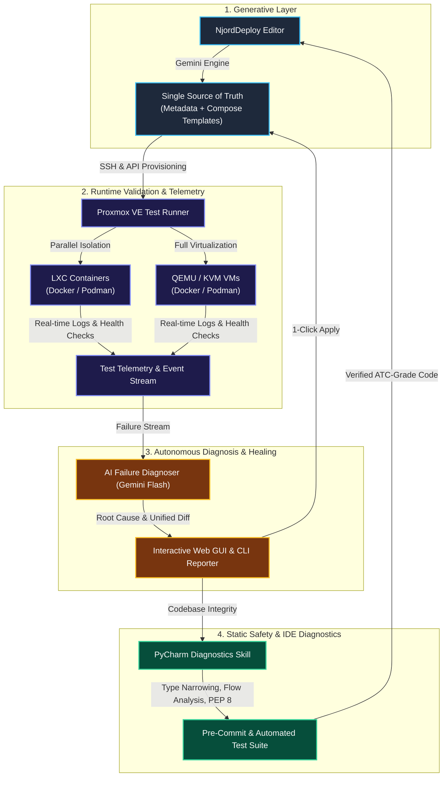

# Whitepaper: Autonomous, Self-Healing DevOps Architecture
## How NjordDeploy Combines AI Generation, Hypervisor-Level Runtime Validation, and IDE Diagnostics into a Zero-Debt Ecosystem

---

### Executive Summary

Deploying and maintaining multiservice self-hosted environments across heterogeneous Linux systems (Debian, Raspberry Pi OS, Docker, Rootless Podman, LXC, and QEMU/KVM VMs) is notoriously complex. Traditional approaches suffer from two main bottlenecks:
1. **Configuration Drift & Human Error**: Writing, templating, and keeping 50+ service definitions up to date requires immense manual effort.
2. **Disconnected Feedback Loops**: Theoretical configurations pass static linting but fail in real runtime environments due to socket permissions, kernel capabilities, or engine quirks.

**NjordDeploy** introduces an engineering paradigm: a **closed-loop, self-healing DevOps triad** where:
1. **AI Generates** declarative service metadata and container configurations.
2. **Proxmox VE Validates** services under live, isolated hypervisor conditions (LXC & VM across Docker and Podman).
3. **Gemini Failure Diagnoser Analyzes** runtime failure patterns and produces one-click unified patches.
4. **PyCharm Diagnostics & Code Quality Engine** automatically enforces Air-Traffic-Control (ATC) grade code quality and type safety, preventing technical debt from accumulating.

---

---

### The Four Pillars of the Architecture

#### 1. Generative Infrastructure as Code (IaC) & Multi-Environment Templating
Instead of manually crafting separate compose files for every Linux distribution, container runtime, and hypervisor mode:
* NjordDeploy uses declarative metadata (`config/components_metadata.json`) as the single source of truth.
* AI engines dynamically generate variable definitions, network contracts, volume mappings, and security policies.
* **Jinja2 Multi-Environment Conditionals**: Templates natively adapt at render-time using injected runtime variables (`CONTAINER_ENGINE`: `docker`/`podman`, `TARGET_MODE`: `lxc`/`vm`, `DATA_ROOT`, `CONFIG_BASE_PATH`). This allows services with specialized discovery requirements (e.g. Home Assistant using `network_mode: host` on Docker and bridge port-mapping on Podman) to maintain a single, elegant template definition.

#### 2. Real-World Bare-Metal & Hypervisor Validation
Static linters cannot predict kernel-level container behavior. NjordDeploy executes automated tests across a comprehensive 4-way cross-validation matrix:
* **Dual-Engine Support**: Simultaneously tests against standard **Docker Engine** and strict **Podman (Rootless/OCI)**.
* **Dual-Isolation Support**: Tests against lightweight **Debian LXC** containers and full **QEMU/KVM Virtual Machines**.
* **Real-time Event Streaming**: A Server-Sent Events (SSE) log streamer provides live feedback directly to the operator and test runner.

#### 3. AI-Powered Root-Cause Analysis & One-Click Remediation
When a component fails integration testing in any matrix quadrant:
* The test runner aggregates stdout, stderr, and container logs.
* Gemini and local AI diagnosers evaluate runtime logs against template specifications to recognize domain-specific engine signatures (e.g. Podman `network_mode: host` conflicts, subuid namespace restrictions, missing Docker daemon sockets, Traefik entrypoint port collisions).
* **Autonomous Target Classification**: Failures are automatically categorized into `TEMPLATE_CONFIG`, `CORE_PLATFORM_CODE`, `ENVIRONMENT_INFRA`, or `MATRIX_CONSTRAINT`.
* **One-Click Patching**: The engine produces unified Jinja2 condition diffs or metadata matrix constraints, allowing developers to inspect and apply verified patches with a single click.

#### 4. The Self-Healing IDE & Code Quality Guardrail
AI-assisted modifications must never degrade software quality:
* The **`pycharm-diagnostics`** skill interacts directly with PyCharm IDE diagnostics via JetBrains Companion MCP.
* Sub-system invariants (type narrowing across `try:` boundaries, subprocess lifecycle null-safety, PEP 8, and Unpacking-First mandates) are strictly enforced in an iterative, self-healing loop.
* Code is not committed until `pre-commit` and `pytest` pass with a 100% clean bill of health.

---

### Key Business & Technical Outcomes

| Metric                                | Traditional Workflow                  | NjordDeploy Self-Healing Pipeline             |
|---------------------------------------|---------------------------------------|-----------------------------------------------|
| **Component Onboarding Time**         | 2 - 4 hours per service               | < 5 minutes (AI generated & auto-tested)      |
| **Edge-Case Detection**               | Discovered by end-users in production | Caught pre-release in Proxmox VM/LXC matrices |
| **Cross-Engine Portability**          | Duplicated compose files per engine   | Single Jinja2 template with dynamic engine context |
| **Diagnosis Time for Runtime Errors** | 30 - 60 minutes manual log tracing    | < 10 seconds via Gemini Systemic Analysis     |
| **Technical Debt & Static Warnings**  | Accumulates over time                 | **0 Warnings / 100% Clean** via PyCharm Skill |
| **Human Role**                        | Repetitive maintenance & bug hunting  | Architectural oversight & final validation    |

---

### Conclusion

NjordDeploy demonstrates the future of software engineering: where **Generative AI** is not merely a chatbot, but an integral component of a closed, feedback-driven engineering loop. By combining generative speed with hypervisor-grade verification, multi-environment Jinja2 composability, and IDE-level static discipline, NjordDeploy delivers robust, enterprise-grade self-hosting software at unprecedented speed.
