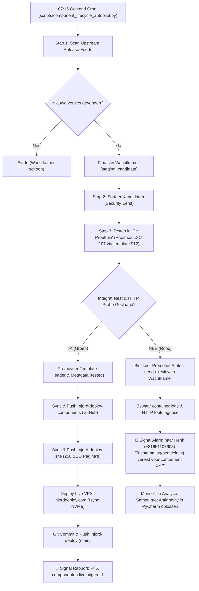

# Component Lifecycle Autopilot

De **Component Lifecycle Autopilot** (`scripts/component_lifecycle_autopilot.py`) is de autonome orchestrator voor het continu detecteren, valideren in Proxmox VE, en naar productie uitrollen van upstream software-updates voor NjordDeploy componenten.

Het systeem volgt het **Autonomous Execution with Human-in-the-Loop on Exception (HITL)** principe:
- **Groen (Happy Flow):** Routine updates worden autonoom getest op Proxmox VE, gepromoveerd in templates en metadata, gesynchroniseerd naar GitHub (`njord-deploy-components` en `njord-deploy-site`), en direct uitgerold naar de live website (`njorddeploy.com`). Henk ontvangt een compact overzichtsbericht op Signal.
- **Rood (Exception Flow):** Bij testfouten, breaking changes of syntaxproblemen wordt de promotie direct geblokkeerd. De update blijft veilig geparkeerd in de Wachtkamer met status `needs_review`. Er wordt een hoge-prioriteit Signal-alarm verstuurd naar Henk met de exacte foutdiagnose en een verzoek om handmatige begeleiding/toestemming.

---

## 1. Architectuur & Workflow



---

## 2. Belangrijkste Eigenschappen & Veiligheid

1. **Anti-Groundhog Day Garantie:**
   - Geen oneindige update-lussen: geteste componenten worden direct op `last_tested_version = latest_upstream_version` gezet.
   - Vastgezette componenten (`pinned: true`) en expliciet genegeerde versies (`ignored_versions`) worden automatisch overgeslagen.
2. **Geïsoleerde Ephemeral Containers:**
   - Elke test kloont de schone Proxmox LXC template `912` naar een tijdelijke container `107`.
   - Na de testcyclus (succes of falen) wordt container `107` altijd direct en gegarandeerd vernietigd (`destroy_lxc`).
   - Er blijft nooit residuele vervuiling of schijfruimtebeslag achter op het Proxmox-cluster.
3. **Beveiligde Multi-Repo Synchronisatie:**
   - Synchroniseert atomair met `njord-deploy-components` (inclusief README.md generatie per component).
   - Bouwt automatisch de 258 statische SEO landingspagina's (EN & NL) en de `sitemap.xml` opnieuw in `njord-deploy-site`.
   - Werkt de live productie VPS (`37.120.176.26`) en lokale standby server (`192.168.178.118`) via `rsync` bij.
4. **Signal REST API Integratie:**
   - Verzendt statusberichten via de lokale Signal CLI REST API op `http://192.168.178.118:8090/v2/send`.
   - Zonder externe cloud-tussenkomst of telemetrie.

---

## 3. Command Line Interface (CLI)

```bash
# Volledige autonome ochtendcyclus (scan -> test -> deploy -> alert):
python3 scripts/component_lifecycle_autopilot.py

# Alleen scannen en kandidaten rapporteren zonder tests uit te voeren:
python3 scripts/component_lifecycle_autopilot.py --check-only

# Alleen bestaande wachtkamer-kandidaten verifiëren (upstream scan overslaan):
python3 scripts/component_lifecycle_autopilot.py --skip-scan

# Eén of meerdere specifieke componenten gericht testen en promoveren:
python3 scripts/component_lifecycle_autopilot.py --components caddy,pi-hole

# Testen zonder externe git-push of VPS deployment (lokale proef):
python3 scripts/component_lifecycle_autopilot.py --skip-sync

# Uitvoeren zonder Signal notificaties:
python3 scripts/component_lifecycle_autopilot.py --no-signal
```

---

## 4. Crontab Configuratie

De dagelijkse uitvoering is gepland om **07:15** 's ochtends — ruim na de Proxmox back-ups (03:00) en voor de dagelijkse supply chain audit (08:00):

```cron
# Daily Component Lifecycle Autopilot (Daily 07:15 - Proxmox test, multi-repo sync, VPS deploy & Signal HITL)
15 7 * * * /usr/bin/python3 /home/hvhoek/PycharmProjects/njord-deploy/scripts/component_lifecycle_autopilot.py >/tmp/component_autopilot.log 2>&1
```
