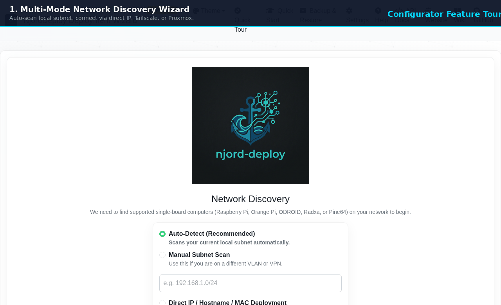
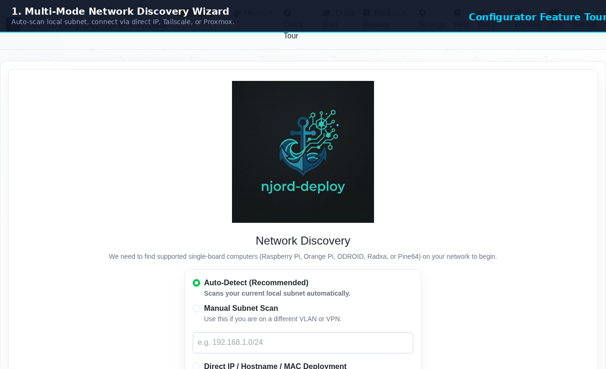
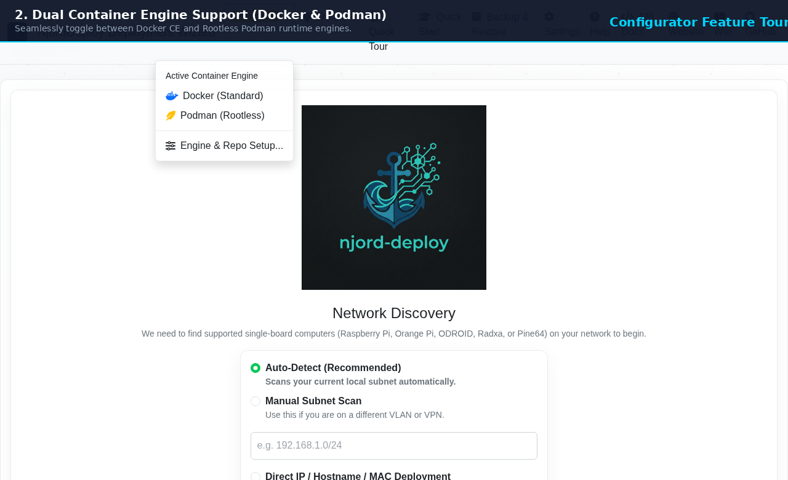
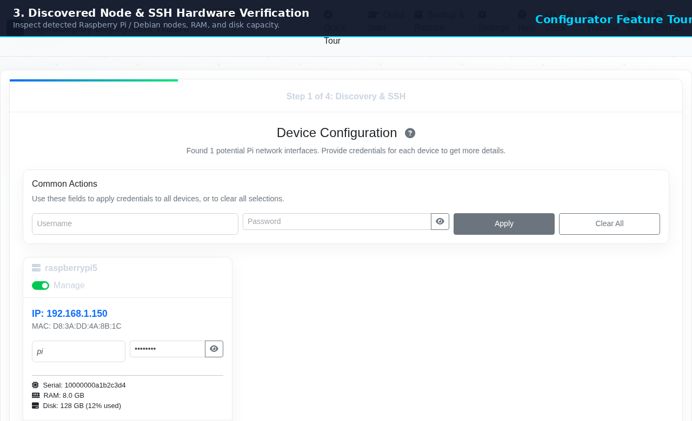
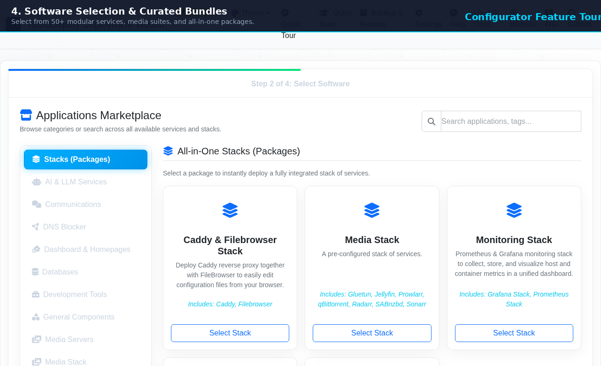
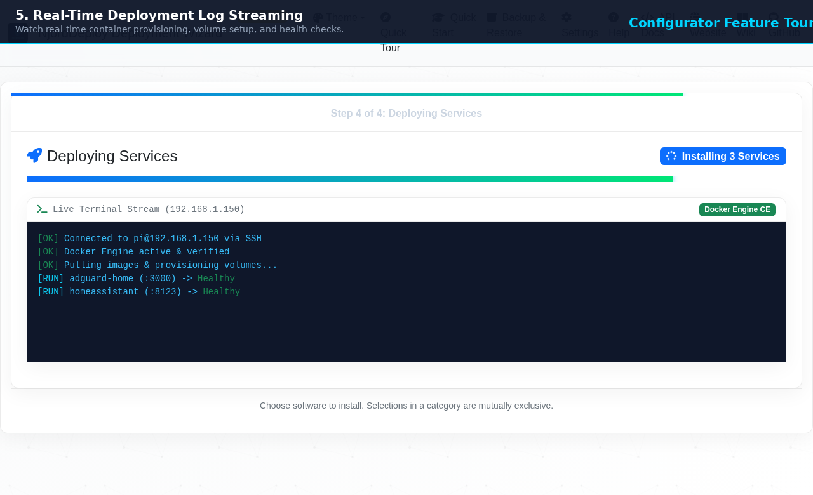
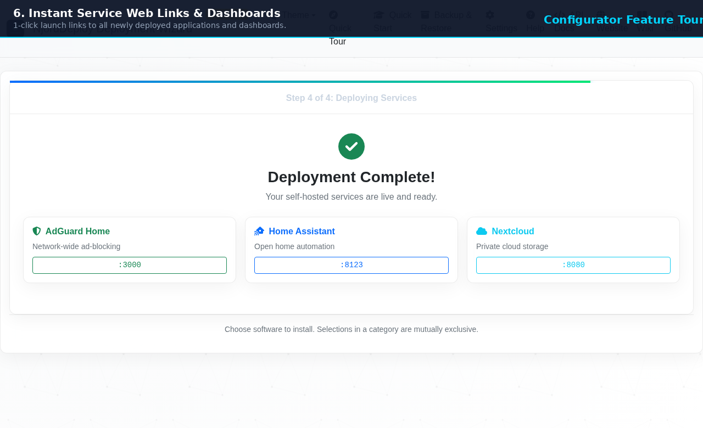
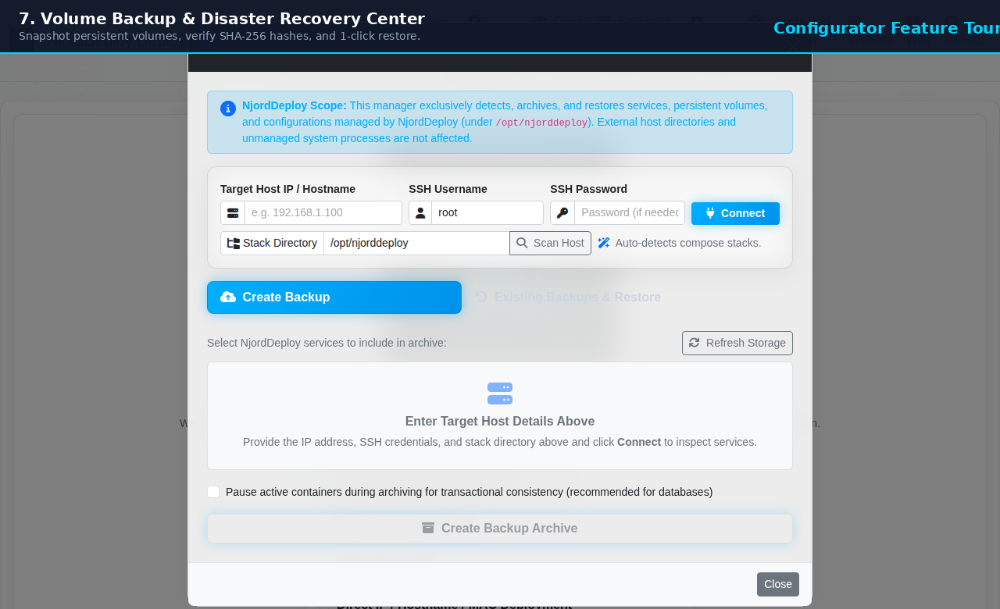
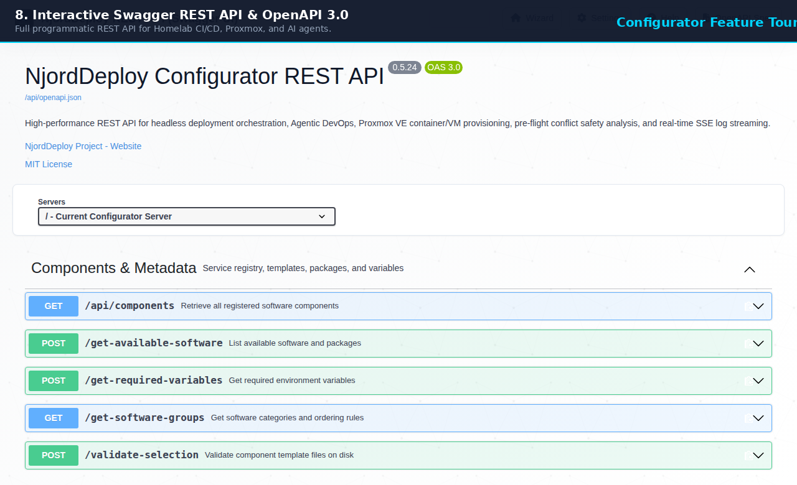

# NjordDeploy Configurator - Visual Feature & Menu Guide

Welcome to the comprehensive feature guide and visual tour for the **NjordDeploy Configurator** (`http://localhost:5001`).

The Configurator is an end-user deployment wizard designed to make discovering, customizing, and provisioning self-hosted Docker and Podman stacks effortless.

---

## 🎬 Animated Feature Tour

---

## 🧭 Menu Options & Wizard Flow Breakdown

### 1. Multi-Mode Network Discovery Wizard

* **Automatic L2 ARP Sweep:** 1-click scanning detects active Raspberry Pi and Linux Single-Board Computers on your local subnet.
* **Direct IP & Hostname:** Connect directly to remote servers or cloud VMs across custom subnets.
* **Tailscale & WireGuard VPN:** Deploy services across secure encrypted mesh overlays without opening router ports.
* **Proxmox VE Integration:** Connect to Proxmox VE nodes to automatically roll out clean test VMs and LXC containers.

---

### 2. Dual Container Engine Support (Docker & Rootless Podman)

* **Top Bar Engine Switcher:** Easily toggle between **Docker CE** (standard daemon) and **Podman** (rootless unprivileged mode).
* **Automatic Kernel Configuration:** In Podman mode, NjordDeploy automatically tunes unprivileged port binding (`net.ipv4.ip_unprivileged_port_start=53`) and enables systemd user session lingering (`loginctl enable-linger`).
* **Engine & Repo Setup Modal:** Switch between the official GitHub component feed, custom GitLab/Forgejo instances, or an offline air-gapped cache.

---

### 3. Discovered Node & SSH Hardware Verification

* **Hardware Pre-flight Check:** Automatically inspects target SBC architecture (ARM64/x86_64), RAM capacity, and available disk space on mounted volumes.
* **SSH Credential Test:** Validates SSH user/password or private key authentication before any commands are executed.
* **Non-Destructive Target Policy:** Deploys via Docker/Podman engines without polluting or depending on a system Python runtime on the host OS.

---

### 4. Software Selection & Curated Bundles

* **50+ Modular Services:** Choose from categorized apps across DNS blocklists, Media suites (*arr stack, Jellyfin), Smart Home (Home Assistant, Frigate), and Private Cloud (Nextcloud, Vaultwarden).
* **Curated All-in-One Stacks:** Deploy complete application environments with one click.
* **Conflict & Dependency Engine:** Prevents port overlaps (e.g. port 80/53 collisions) and automatically suggests required database/cache companion containers.

---

### 5. Real-Time Deployment Log Streaming

* **Live WebSocket / EventStream Terminal:** Watch real-time container image pulls, volume mounting, and environment injection.
* **Progress Line & Phase Indicators:** Transparent progress monitoring across engine setup, volume creation, and container startup.
* **Automated Health Checks:** Validates container exit codes and HTTP healthcheck probes before declaring success.

---

### 6. Instant Service Web Links & Live Dashboards

* **1-Click Dashboard Access:** Direct web links to all newly provisioned services (e.g. `:3000` for AdGuard, `:8123` for Home Assistant, `:8080` for Nextcloud).
* **Summary Overview:** Displays container engine statuses, persistent storage locations, and local network URLs.

---

### 7. Volume Backup & Disaster Recovery Center

* **Point-in-Time Snapshots:** Back up all persistent application data, database files, and config volumes with transactional pause.
* **SHA-256 Integrity Verification:** Every backup archive is cryptographically verified to prevent corruption.
* **1-Click Disaster Recovery:** Restore complete environments or individual service states in seconds.

---

### 8. Interactive Swagger REST API (OpenAPI 3.0)

* **Headless DevOps & AI Control:** Full REST API available at `http://localhost:5001/api/docs`.
* **Agentic Automation:** Designed for CI/CD pipelines and AI coding agents (Antigravity/Agy) to programmatically scan networks, evaluate pre-flight safety, and trigger deployments.
* **Interactive Testing:** Execute live API requests directly within the browser with light/dark theme support.
