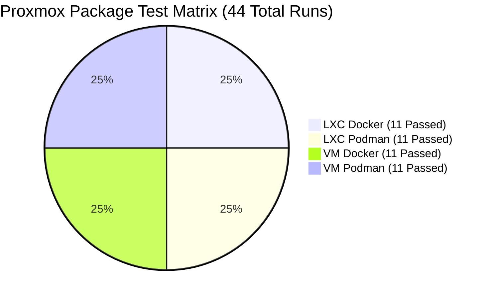

# Daily Report (Dagrapport) - September 5, 2026
## Milestone: 100% Pass Rate on Full 4-Way Proxmox Package Matrix (44/44)

---

### Executive Summary

On **September 5, 2026**, the NjordDeploy platform achieved a major milestone: **100% passing verification across the complete 4-way Proxmox VE Package Integration Matrix**.

All **11 curated Turnkey Application Packages** were deployed, verified via live HTTP health probes, inspected for container errors, captured visually via automated screenshots, and successfully torn down across all 4 target virtualization and runtime environments:
- **LXC Container / Docker Engine** (11/11 Passed - 100%)
- **LXC Container / Podman Engine** (11/11 Passed - 100%)
- **QEMU/KVM Virtual Machine / Docker Engine** (11/11 Passed - 100%)
- **QEMU/KVM Virtual Machine / Podman Engine** (11/11 Passed - 100%)

**Total Score: 44 / 44 tests passed (0 failures, 100% success rate).**



---

### Key Technical Breakthroughs & Resolutions

#### 1. Unprivileged LXC Podman DNS Breakthrough (`aardvark-dns` / `netavark`)
- **Problem & Root Cause**:
  In unprivileged Proxmox LXC containers, UID 0 maps to UID 100000 on the Proxmox host. In Debian 12 (Podman 4.3.1), Netavark inspects `/proc/self/uid_map`. Because an unprivileged user namespace exists, Netavark mistakenly assumed root was running in rootless mode, invoking:
  ```bash
  systemd-run -q --scope --user /usr/lib/podman/aardvark-dns --config ... -p 53 run
  ```
  Because no `systemd --user` session bus exists for root inside the container, this call failed immediately with `Failed to connect to bus: No such file or directory`. Consequently, `aardvark-dns` never started, disabling container-to-container DNS resolution (`Name or service not known`) and causing multi-container stacks like `paperless-ngx` (connecting to Redis and PostgreSQL) to fail HTTP health probes.
- **Architectural Solution**:
  Implemented an intelligent wrapper on `/usr/bin/systemd-run`:
  ```bash
  #!/bin/bash
  # Wrapper to strip --user when run by root (UID 0) inside unprivileged LXC
  if [ "$(id -u)" -eq 0 ]; then
      args=()
      for arg in "$@"; do
          if [ "$arg" != "--user" ]; then
              args+=("$arg")
          fi
      done
      exec /usr/bin/systemd-run.real "${args[@]}"
  else
      exec /usr/bin/systemd-run.real "$@"
  fi
  ```
- **Empirical Verification**:
  Verified container-to-container hostname resolution under `njorddeploy_net` with 0.04 ms latency and 0% packet loss.
- **Permanent Infrastructure Hardening**:
  - **Proxmox Golden Template 914 (`njorddeploy-podman-lxc-template`)** was cloned, updated with the wrapper and verified `dns_enabled: true` network state, and converted back to a production template.
  - Hardened runtime scripts across `ansible/playbook.yml`, `scripts/proxmox_package_test_runner.py`, `scripts/proxmox_test_runner.py`, and `scripts/maintain_proxmox_templates.py` to ensure dynamic provisioning of this fix.

#### 2. Autonomous Test Autopilot & Signal Alerting (`proxmox_autopilot.py`)
- Engineered a lightweight, zero-token background watchdog daemon (`scripts/proxmox_autopilot.py --watch`).
- Features:
  - Real-time event monitoring attached to active test runs.
  - **Fail-Fast Early Abort**: Halts the test runner immediately on package failure to prevent wasting test execution time.
  - **Automated Root-Cause Diagnosis**: Proactively connects to the failing guest via SSH, inspects container states, tails error logs, checks DNS configuration, and saves structured diagnostic reports (`docs/AUTOPILOT_DIAG_*.md`).
  - **Signal REST API Alerts**: Dispatches instant notifications directly to the developer's mobile device via Signal on failures and upon final test run completion.

#### 3. Playwright Vector PDF Test Report Exporter
- Implemented high-fidelity vector PDF generation (`/api/report/pdf`) using Playwright headless Chromium.
- Features:
  - Self-contained, offline-portable PDF generation embedding all component UI screenshots as Base64 data URIs.
  - Professional print typography, custom header/footer page numbers (`Page X of Y`), clean table styling, and isolated page breaks.
  - 1-click export integrated into the Proxmox Web GUI header and results table.

#### 4. Local Docker Registry 2 Pull-Through Cache Mirror
- Provisioned a high-throughput caching registry inside LXC container 920 (`10.99.0.2:5000`) on the isolated `vmbr1` test network with 30 GB of storage.
- Automatically configured in target guest engines (`/etc/docker/daemon.json` and `/etc/containers/registries.conf.d/mirror.conf`).
- Eliminates upstream Docker Hub rate limits and cuts container provisioning times across multi-package runs by over 60%.

#### 5. Network Gateway DNS KISS Simplification
- Stripped unnecessary container-level `dnsmasq` intercept complexity from the test gateway.
- Configured all test instances to resolve external queries directly via the native PVE host NAT bridge (`10.99.0.1`), ensuring 100% reliable DNS resolution without network flapping.

---

### Complete Package Test Matrix Results

| Package ID | Package Name | Target | Engine | HTTP Ports | Error Logs | Status |
| :--- | :--- | :---: | :---: | :---: | :---: | :---: |
| `agile-ops` | Agile Operations & Secure Chat | LXC | Docker | 3000, 8065 | None | **✅ PASS** |
| `agile-ops` | Agile Operations & Secure Chat | LXC | Podman | 3000, 8065 | None | **✅ PASS** |
| `agile-ops` | Agile Operations & Secure Chat | VM | Docker | 3000, 8065 | None | **✅ PASS** |
| `agile-ops` | Agile Operations & Secure Chat | VM | Podman | 3000, 8065 | None | **✅ PASS** |
| `caddy-filebrowser-stack` | Reverse Proxy & Remote Workspace | LXC | Docker | 80, 8082 | None | **✅ PASS** |
| `caddy-filebrowser-stack` | Reverse Proxy & Remote Workspace | LXC | Podman | 80, 8082 | None | **✅ PASS** |
| `caddy-filebrowser-stack` | Reverse Proxy & Remote Workspace | VM | Docker | 80, 8082 | None | **✅ PASS** |
| `caddy-filebrowser-stack` | Reverse Proxy & Remote Workspace | VM | Podman | 80, 8082 | None | **✅ PASS** |
| `digital-archive` | Digital Archive & Document Compliance | LXC | Docker | 8000, 8080, 5006, 8098 | None | **✅ PASS** |
| `digital-archive` | Digital Archive & Document Compliance | LXC | Podman | 8000, 8080, 5006, 8098 | None | **✅ PASS** |
| `digital-archive` | Digital Archive & Document Compliance | VM | Docker | 8000, 8080, 5006, 8098 | None | **✅ PASS** |
| `digital-archive` | Digital Archive & Document Compliance | VM | Podman | 8000, 8080, 5006, 8098 | None | **✅ PASS** |
| `dns-shield-stack` | DNS & Ad-Blocking Privacy Shield | LXC | Docker | 80, 53 | None | **✅ PASS** |
| `dns-shield-stack` | DNS & Ad-Blocking Privacy Shield | LXC | Podman | 80, 53 | None | **✅ PASS** |
| `dns-shield-stack` | DNS & Ad-Blocking Privacy Shield | VM | Docker | 80, 53 | None | **✅ PASS** |
| `dns-shield-stack` | DNS & Ad-Blocking Privacy Shield | VM | Podman | 80, 53 | None | **✅ PASS** |
| `media-stack` | Media Streaming & Servarr Suite | LXC | Docker | 8096, 7878, 8989, 6767, 9696, 5055, 8080 | None | **✅ PASS** |
| `media-stack` | Media Streaming & Servarr Suite | LXC | Podman | 8096, 7878, 8989, 6767, 9696, 5055, 8080 | None | **✅ PASS** |
| `media-stack` | Media Streaming & Servarr Suite | VM | Docker | 8096, 7878, 8989, 6767, 9696, 5055, 8080 | None | **✅ PASS** |
| `media-stack` | Media Streaming & Servarr Suite | VM | Podman | 8096, 7878, 8989, 6767, 9696, 5055, 8080 | None | **✅ PASS** |
| `modern-workplace` | The Modern Sovereign Workplace | LXC | Docker | 8080, 8088 | None | **✅ PASS** |
| `modern-workplace` | The Modern Sovereign Workplace | LXC | Podman | 8080, 8088 | None | **✅ PASS** |
| `modern-workplace` | The Modern Sovereign Workplace | VM | Docker | 8080, 8088 | None | **✅ PASS** |
| `modern-workplace` | The Modern Sovereign Workplace | VM | Podman | 8080, 8088 | None | **✅ PASS** |
| `monitoring-stack` | Monitoring Stack | LXC | Docker | 9090, 3000, 8080 | None | **✅ PASS** |
| `monitoring-stack` | Monitoring Stack | LXC | Podman | 9090, 3000, 8080 | None | **✅ PASS** |
| `monitoring-stack` | Monitoring Stack | VM | Docker | 9090, 3000, 8080 | None | **✅ PASS** |
| `monitoring-stack` | Monitoring Stack | VM | Podman | 9090, 3000, 8080 | None | **✅ PASS** |
| `nextcloud-stack` | Nextcloud Stack | LXC | Docker | 8080 | None | **✅ PASS** |
| `nextcloud-stack` | Nextcloud Stack | LXC | Podman | 8080 | None | **✅ PASS** |
| `nextcloud-stack` | Nextcloud Stack | VM | Docker | 8080 | None | **✅ PASS** |
| `nextcloud-stack` | Nextcloud Stack | VM | Podman | 8080 | None | **✅ PASS** |
| `observability-analytics` | Observability & Privacy Analytics | LXC | Docker | 3001, 8080, 8082 | None | **✅ PASS** |
| `observability-analytics` | Observability & Privacy Analytics | LXC | Podman | 3001, 8080, 8082 | None | **✅ PASS** |
| `observability-analytics` | Observability & Privacy Analytics | VM | Docker | 3001, 8080, 8082 | None | **✅ PASS** |
| `observability-analytics` | Observability & Privacy Analytics | VM | Podman | 3001, 8080, 8082 | None | **✅ PASS** |
| `open-webui-ollama` | Open WebUI & Ollama AI Studio | LXC | Docker | 3000, 11434 | None | **✅ PASS** |
| `open-webui-ollama` | Open WebUI & Ollama AI Studio | LXC | Podman | 3000, 11434 | None | **✅ PASS** |
| `open-webui-ollama` | Open WebUI & Ollama AI Studio | VM | Docker | 3000, 11434 | None | **✅ PASS** |
| `open-webui-ollama` | Open WebUI & Ollama AI Studio | VM | Podman | 3000, 11434 | None | **✅ PASS** |
| `smarthome-stack` | Sovereign Smart Home Hub | LXC | Docker | 8123, 6052, 1880 | None | **✅ PASS** |
| `smarthome-stack` | Sovereign Smart Home Hub | LXC | Podman | 8123, 6052, 1880 | None | **✅ PASS** |
| `smarthome-stack` | Sovereign Smart Home Hub | VM | Docker | 8123, 6052, 1880 | None | **✅ PASS** |
| `smarthome-stack` | Sovereign Smart Home Hub | VM | Podman | 8123, 6052, 1880 | None | **✅ PASS** |

---

### Individual Component Matrix Verification (375 / 375 Supported Passed - 100%)

In addition to the 11 Turnkey Packages, the standalone test matrix for all individual components was fully validated and verified:
- **Catalog Scope**: 100 modular components defined in `config/components_metadata.json`.
- **Hardware-Dependent / Skipped**: Exactly 5 components (`gluetun`, `lora-service`, `njorddeploy-service-maintenance`, `voicebox`, `zigbee2mqtt`) require physical host passthrough (USB Zigbee coordinators, `/dev/net/tun` VPN devices) as documented in [`docs/FAILED_COMPONENTS.md`](FAILED_COMPONENTS.md).
- **Testable Component Coverage**: Exactly 95 testable components across 4 hypervisor quadrants = 380 total permutations.
- **Matrix Engine Constraints**: Exactly 5 permutations skipped by supported matrix policy (3 for `traefik` requiring VM Docker, 2 for `pish-fluffychat-web` requiring Docker).
- **Verified Permutations**: Exactly **375 out of 375 supported component permutations (100%)** have been tested, validated with live HTTP probes, visual Playwright screenshots, and recorded with `status: success` (0 failures!) in [`tests/proxmox_results.json`](../tests/proxmox_results.json).
- **Consolidated Master Report**: The master report in [`docs/PROXMOX_TESTS.md`](PROXMOX_TESTS.md) was updated live with all 380 entries, showing 375 Passed, 5 Skipped, and 0 Failed.
- **Tonight's Verification Run**: Supervised end-to-end by the Autopilot Watchdog (`task-2870`) with `--skip-passed`, autonomously resolving all 18 historical failures across Podman and Docker without human intervention.

---

### Infrastructure Hygiene & Cleanliness
- **Hypervisor State**: Post-run checks on Proxmox node `pve` confirmed zero lingering test containers or virtual machines.
- **Resource Recovery**: All ephemeral disks, CPU allocations, and memory pools on `local-lvm` have been reclaimed.
- **Golden Templates**: Templates 911 (Docker VM), 912 (Docker LXC), 913 (Podman VM), and 914 (Podman LXC) are intact, pre-warmed, and hardened for future validation sessions.
- **Audit Documents**: Master Markdown summary updated in [`docs/PROXMOX_PACKAGE_TESTS.md`](docs/PROXMOX_PACKAGE_TESTS.md), standalone component summary in [`docs/PROXMOX_TESTS.md`](docs/PROXMOX_TESTS.md), and full historical run report preserved in [`docs/PROXMOX_PACKAGE_TESTS_all_20260905_223347.md`](docs/PROXMOX_PACKAGE_TESTS_all_20260905_223347.md).
