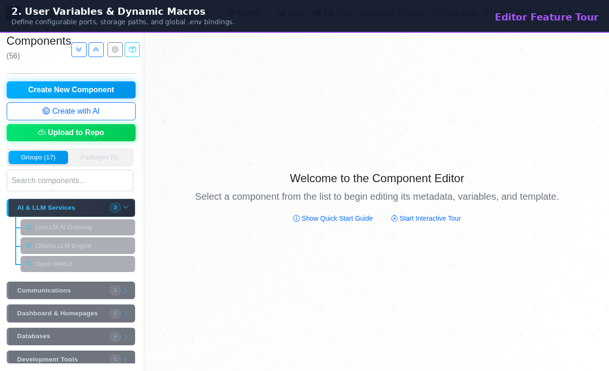
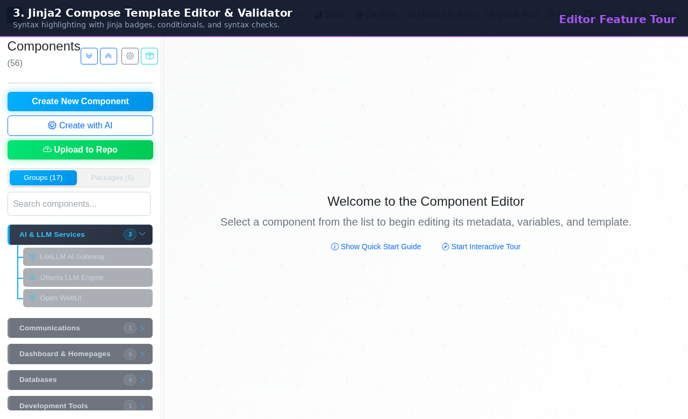
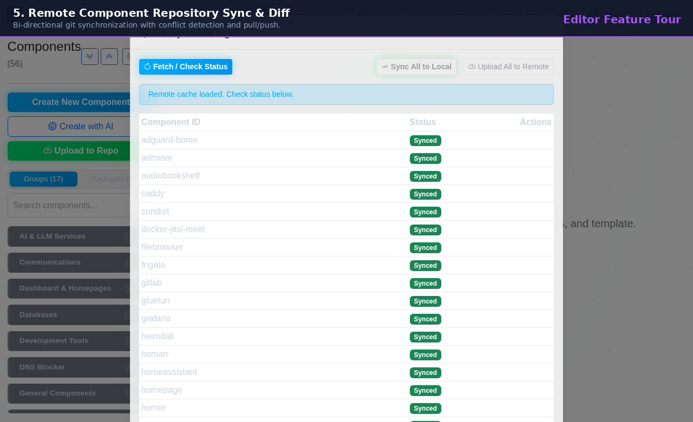
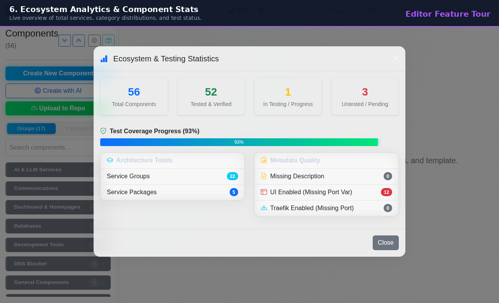
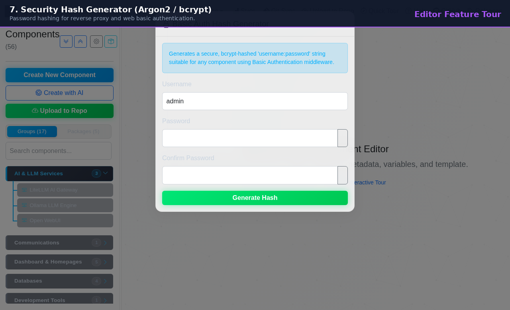
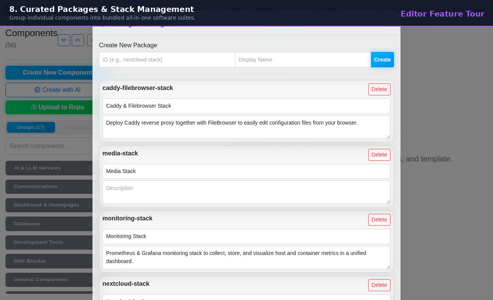

# NjordDeploy Component Editor - Visual Feature & Menu Guide

Welcome to the comprehensive feature guide and visual tour for the **NjordDeploy Component Editor** (`http://localhost:5000`).

The Component Editor is a developer and maintainer workspace for creating, inspecting, customizing, and synchronizing modular self-hosted service definitions within the NjordDeploy ecosystem.

---

## 🎬 Animated Feature Tour

---

## 🧭 Menu Options & Workspace Breakdown

### 1. Main Workspace & Sidebar Navigation

* **Groups vs Packages View:** Toggle between browsing individual service categories (DNS, AI, Media, Smart Home) or bundled all-in-one software stacks.
* **Instant Filtering & Search:** Rapid real-time search across 50+ modular components by name, description, tags, or ports.
* **Expand / Collapse All:** Quick controls to inspect deep category trees with 1 click.
* **Theme Switching:** Choose between *Futuristic Dark (Glassmorphic)*, *Standard Light*, and *High Contrast* accessibility modes.

---

### 2. User Variables & Dynamic Macro System

* **Variable Definition:** Configure environment variables, port bindings, and storage mounts exposed to end-users during deployment.
* **Dynamic Macro System:**
  * `{{ CONFIG_BASE_PATH }}/your-service`: Generates portable data paths across target hosts.
  * `{{ DOTENV.YOUR_VAR }}`: Binds component variables dynamically to the target server's global `.env` file.
* **Field Validation:** Built-in schema validation for port ranges (1–65535), boolean flags, and directory paths.

---

### 3. Jinja2 Docker Compose Template Editor & Validator

* **Syntax Highlighting & Formatting:** Jinja2 + YAML template editor tailored for modern Docker Compose definitions.
* **Jinja Context Badges:** Click to insert standard contextual variables:
  * `{{ CONTAINER_ENGINE }}`: Resolves to `docker` or `podman`.
  * `{{ TARGET_MODE }}`: Resolves to `lxc` or `vm`.
  * `{{ DATA_ROOT }}` & `{{ CONFIG_BASE_PATH }}`.
* **Conditionals Dropdown:** Quick insertion of engine-specific blocks (``).
* **Live Template Validation:** Evaluates Jinja syntax and Compose YAML structure before saving.

---

### 4. AI Component Generator (HostYourAI / Loes)

* **1-Click Git Ingestion:** Input any public repository URL (**GitHub, GitLab, Forgejo, Codeberg, Bitbucket, or self-hosted Git**).
* **Name Disambiguation:** Custom component ID field (e.g. `immich-custom`) prevents collisions with existing library components.
* **European Sovereign AI:** Powered by **HostYourAI / Loes (EU Sovereign Cloud)** for privacy-first, GDPR-compliant AI generation, as well as local Ollama, Google Gemini, and OpenAI.
* **Deep Context Stepper:** Automatically fetches `README.md` and Compose files, generates ports, and validates non-root volume permissions.

---

### 5. Remote Component Repository Sync & Diff

* **Decoupled Architecture:** Components are maintained in a dedicated repository (`HenkVanHoek/njord-deploy-components`).
* **Bi-Directional Diffing:** Inspect local vs remote modifications before pulling or pushing.
* **Write Permission Verification:** Automated SSH / token verification ensures authorized uploads.
* **Required Template Headers:** Enforces governance standards (`# status:`, `# last_tested_version:`, `# platform_notes:`).

---

### 6. Ecosystem Analytics & Component Statistics

* **Live Library Metrics:** Total active services, groups, packages, and tested statuses.
* **Category Distribution:** Visual charts displaying service distribution across AI, DNS, Media, Smart Home, and Databases.
* **Compatibility Matrix:** Quick view of Docker vs Podman support across all components.

---

### 7. Security Hash Generator (Basic Auth)

* **Built-in Crypto Utility:** Generates secure password hashes for reverse proxies (Nginx Proxy Manager, Caddy, Traefik).
* **Supported Algorithms:** **Argon2id**, **bcrypt**, and **SHA-512**.
* **1-Click Copy:** Copies formatted auth strings directly into user variable configurations.

---

### 8. Curated Packages & Stack Management

* **All-in-One Stacks:** Combine complementary services (e.g. *AdGuard Home + Unbound*, *Nextcloud + Redis + MariaDB*, *Frigate + Coral TPU*) into 1-click installable bundles.
* **Dependency & Conflict Rules:** Define required companion services and mutual exclusivity rules.
