# NjordDeploy Fleet Update Management System (FUMS) - Design Document

**Document Version:** 1.3.0
**Status:** Architectural Blueprint & Production Specification
**Date:** 2026-09-14
**Author:** Henk van Hoek & Antigravity
**Domain:** njorddeploy.com

---

## 1. Executive Summary & Context

NjordDeploy provides containerized self-hosted stacks (such as the *Sovereign Stack*) for paying enterprise and prosumer clients. While container technologies allow continuous software updates, unmanaged or fully automatic update cycles (e.g., blind Watchtower triggers) carry significant risks of unexpected downtime, breaking schema migrations (e.g., PostgreSQL major versions), and incompatibility with customer operations (such as scheduled hardware maintenance or peak operating hours).

This design document outlines the **Fleet Update Management System (FUMS)**. FUMS is hosted centrally on **VM 140** (`njorddeploy-vm`) and implements a customer-centric **Approval & Dispatch Workflow** backed by:
1. **Release Intelligence AI Agent (RISA)** for upstream changelog and diff mining.
2. **Dual-Mode Proxmox Staging Sandbox ("De Proeftuin")**:
   - *Mode A (Gatekeeper)*: Automated zero-risk synthetic verification of database migrations.
   - *Mode B (Interactive Training & UAT)*: On-demand customer sandboxes for staff training, documentation, and formal acceptance testing prior to production rollout.
3. **Air-Traffic-Control Grade Execution Engine** with atomic database rollbacks.

### Core Guiding Principle:
> *"The platform detects releases, analyzes breaking changes via AI, verifies updates in an isolated Proxmox sandbox, and offers on-demand interactive customer training environments; the customer retains absolute control over business timing, user readiness, and deployment strategy."*

---

## 2. Architectural Overview

```mermaid
flowchart TD
    %% 1. Detection & AI Intelligence
    subgraph S1 ["1. Detectie & AI Release Intelligence (VM 140 Hub)"]
        MON["DIUN / Registry Monitor"] -->|Nieuwe versie gedetecteerd| AI_AGENT["🤖 Release Intelligence AI Agent (RISA)"]

        subgraph RISA_Process ["RISA Deep Inspection Cyclus"]
            AI_AGENT --> GITHUB_API["1. Analyseer GitHub Release Notes & Changelogs"]
            AI_AGENT --> DIFF_CHECK["2. Git Diff Compose/Env & Schema Changes"]
            AI_AGENT --> RISK_CLASSIFY["3. Risico Classificatie:<br/>(Groen: Routine / Oranje: Env / Rood: Major/Breaking)"]
        end
    end

    %% 2. De Proeftuin Sandbox (Modus A: Gatekeeper)
    subgraph S2 ["2. Proeftuin Modus A: Geautomatiseerde Gatekeeper (Proxmox)"]
        RISK_CLASSIFY -->|Rood of Major Versie Update| SANDBOX["Start Ephemeral Proxmox Sandbox"]
        SANDBOX --> PROV["Start tijdelijke kloon / LXC container"]
        PROV --> SEED["Seed met geanonimiseerd DB schema / doelconfiguratie"]
        SEED --> TEST_UPDATE["Voer migratie & container start uit"]
        TEST_UPDATE --> TEST_HC{"Geautomatiseerde Integratie & Health Test"}

        TEST_HC -->|Test Faalt| AI_DIAG["AI Foutanalyse & Quarantaine<br/>(Meld direct aan Henk; Update NIET aanbieden aan klanten)"]
        TEST_HC -->|Test Slaagt 100%| CERT["✅ Release Gecertificeerd in Proeftuin"]
        CERT --> DESTROY_GK["Vernietig Gatekeeper container (Schoon)"]
    end

    %% 3. Klant Interactie & Keuzematrix
    subgraph S3 ["3. Klantkeuze & Keuzematrix (Signal / Matrix / Mail)"]
        RISK_CLASSIFY -->|Groen / Routine Patch| DISP["Notification Dispatcher"]
        CERT --> DISP

        DISP -->|Advies + Certificering + Opties| NOTIF["Klantkanaal<br/>(Signal / Matrix / Mail / Web)"]

        NOTIF --> CLIENT{"Klant Keuze:"}

        %% Keuze 1: Direct of Gepland naar Productie
        CLIENT -->|Optie 1: Productie Uitrol| PROD_REQ["Selecteer Timing (Nu/Nacht/Datum)<br/>& Methode (High-Safety / Fast)"]
        PROD_REQ --> API["NjordDeploy Approval API<br/>(VM 140:5001)"]

        %% Keuze 2: Interactieve Trainings-Proeftuin
        CLIENT -->|Optie 2: Aanvraag Training/UAT| TRAIN_REQ["Aanvraag Trainings-Sandbox<br/>(bijv. 7 of 14 dagen TTL)"]
        TRAIN_REQ --> API
    end

    %% 4. Proeftuin Modus B: Interactieve Klant Trainings-omgeving
    subgraph S4 ["4. Proeftuin Modus B: Interactieve Klant Sandbox (Training & UAT)"]
        API -->|Bij Trainingsaanvraag| PROV_TRAIN["Spin-up Geïsoleerde Trainings-LXC op Proxmox"]
        PROV_TRAIN --> MASK_DATA["Importeer gemaskeerde/geanonimiseerde data"]
        MASK_DATA --> TRAIN_URL["Geef beveiligde URL uit:<br/>https://training-klant.njorddeploy.com"]

        TRAIN_URL --> TRAIN_OPS["Klant traint personeel, maakt handleidingen<br/>en voert UAT acceptatietesten uit"]
        TRAIN_OPS --> UAT_SIGNOFF["Key-User geeft formele UAT Sign-off"]
        UAT_SIGNOFF --> API
        UAT_SIGNOFF --> DESTROY_TRAIN["Afbraak & opschonen Trainings-omgeving"]
    end

    %% 5. Planning & Taakqueue
    subgraph S5 ["5. Planning & Orchestratie (VM 140 Hub)"]
        API -->|Bij Productie Go-Live| DB[("SQLite Task Queue<br/>(Geplande jobs & methodes)")]
        DB -->|Trigger op gepland moment| LOCK["Verkrijg Lockfile<br/>(/run/njord_updating.lock)"]
        LOCK --> RUNNER["Ansible Update Orchestrator"]
    end

    %% 6. Doelhost Uitvoering
    subgraph S6 ["6. Doelhost / Klant Stack (LXC / VM)"]
        RUNNER --> PRE_CHECK{"Disk Space Pre-flight:<br/>>= 2.5x Image + DB omvang?"}

        PRE_CHECK -->|Onvoldoende ruimte| FAIL_SPACE["Afbreken & Melden: Schijf vol"]
        PRE_CHECK -->|Voldoende ruimte| PRE_ACTION["Pre-Flight Strategie (RISA Recept):<br/>- CoW Snapshot of Atomaire DB Dump + Config<br/>(Bulk media uploads uitsluiten!)"]

        PRE_ACTION --> DEPLOY["Container Update:<br/>docker/podman compose pull & up -d"]
        DEPLOY --> HC{"Health Check OK?<br/>(HTTP 200 & Container State)"}

        HC -->|JA: Succes| CLEAN["Snapshot bewaren & Oude images opschonen"]
        HC -->|NEE: Fout| ROLLBACK["Automatische Atomaire Rollback:<br/>Herstel DB Dump/Volume + herstart vorige tag"]
    end

    %% 7. Terugkoppeling, Decharge & Escalatie
    subgraph S7 ["7. Terugkoppeling, Decharge & Escalatie"]
        CLEAN --> REPORT_OK["Statusrapport: SUCCES<br/>- Downtime duur geregistreerd<br/>- Nieuwe versienummers actief"]
        ROLLBACK --> REPORT_FAIL["Alarmrapport: GEFAALD & HERSTELD<br/>- Reden van falen inzichtelijk<br/>- Rollback status geverifieerd"]

        REPORT_OK --> CLIENT_FEEDBACK["Klant Notificatie (Signal / Matrix / Mail)"]
        REPORT_FAIL --> CLIENT_FEEDBACK

        REPORT_FAIL --> ADMIN_ESCALATE["🚨 Prioriteit Melding naar Beheerder (Henk)<br/>(Direct signaal via Signal voor recept-onderzoek)"]

        REPORT_OK --> AUDIT[("Audit Log & Obsidian Logboek<br/>(Henks Geheugen)")]
        REPORT_FAIL --> AUDIT
    end
```



---

## 3. De Twee Modi van "De Proeftuin"

### 3.1. Modus A: Geautomatiseerde Gatekeeper (Synthetisch & Vluchtig)
* **Doel:** 100% voorkomen dat een kapotte upstream update of falende database-migratie bij een klant terechtkomt.
* **Trigger:** Volledig autonoom zodra RISA een update classificeert als **ROOD** of **Major Version**.
* **Duur:** Enkele minuten.
* **Werking:**
  1. Start een ephemeral LXC/kloon op Proxmox via [`scripts/proxmox_test_runner.py`](file:///home/hvhoek/PycharmProjects/njord-deploy/scripts/proxmox_test_runner.py).
  2. Voert de migratie uit tegen een geanonimiseerd schema.
  3. Verifieert container-status en API-endpoints (`healthy` status / HTTP 200).
  4. Bij falen: **Quarantaine**. Henk ontvangt direct een bugrapport; de update wordt geblokkeerd.
  5. Bij succes: Keurmerk *"Gecertificeerd in Proeftuin"* wordt toegekend. De container wordt direct vernietigd.

### 3.2. Modus B: Interactieve Klant Sandbox (Training & UAT)
* **Doel:** Medewerkers trainen, screenshots/handleidingen maken en formele Customer Acceptance Testing (UAT) uitvoeren vóór de livegang.
* **Trigger:** On-demand aangevraagd door de klant via Signal/Matrix of het webportaal bij een major update.
* **Duur:** 7 tot 14 dagen (met automatische Time-To-Live).
* **Data Privacy & Dummy Seeding (KISS):**
  - *Standaard:* Gebruikt een **schone 'seed'-database** met dummy-accounts en testdata. Volledig AVG/GDPR-veilig, direct operationeel en geen risico op lekken van persoonsgegevens.
  - *Custom:* Data-masking op klantdata uitsluitend op expliciet verzoek met specifieke transformatiescripts en verwerkersovereenkomst.
* **Netwerk-Isolatie & Mailpit Catcher:**
  - Uitgaande SMTP- en webhook-verbindingen worden in trainingsomgevingen afgevangen en omgeleid naar een lokale dummy-catcher (**Mailpit**). Voorkomt dat cursisten per ongeluk echte klanten of leveranciers mailen.
* **Resource Beheer & Concurrency Quota:**
  - **Quotum:** Maximaal 3 gelijktijdige actieve klant-sandboxes op Proxmox.
  - **Nightly Sleep:** Trainingscontainers worden buiten kantoortijden (19:00 - 07:00) automatisch gepauzeerd/gestopt om CPU en RAM vrij te houden.
* **UAT Sign-off:** Zodra de key-user de formele **UAT Sign-off** geeft, plant FUMS de echte productie-update in en breekt de trainingscontainer automatisch af.

---

## 4. Technische Pijlers & Safeguards

### 4.1. Release Intelligence AI Agent (RISA) Token Hygiene
* Om token-explosies en context-window overflow bij omvangrijke upstream changelogs te voorkomen, hanteert RISA een **pre-filtering pipeline**:
  - **Targeted File Inspection:** Inspecteert uitsluitend `docker-compose.yml`, `Dockerfile`, `.env.example`, `MIGRATION.md` en release highlights (geen ruwe applicatie-sourcecode).
  - **Regex Prioritering:** Filtert release notes primair op signaalwoorden: `BREAKING`, `DEPRECATED`, `DATABASE`, `MIGRATION`, `ENV_VAR`, `SCHEMA`.
* Genereert op basis hiervan een compact machine-recept (JSON) voor Ansible én een begrijpelijke samenvatting voor de klant.

### 4.2. Het Database-Migratie Rollback Dilemma (Atomaire State)
* Onder **High-Safety** zijn Database Dump + Config State een onlosmakelijke atomaire eenheid.
* Mislukt de health check in productie? FUMS voert **altijd** zowel de image-tag revert als een harde database-restore uit. Geen enkele oude container start ooit op een gemuteerde database.

### 4.3. Bulk Media vs. State Scheiding (De 500GB Valkuil)
* FUMS scheidt **Applicatiestate & Database** (binnen seconden geback-upt) strikt van **Bulk Media Mounts** (foto's/video's).
* Waar beschikbaar gebruikt Proxmox ZFS/Btrfs CoW (Copy-on-Write) snapshots voor nagenoeg instantane snapshots.

### 4.4. Security, Concurrency & Pre-flights
* **Disk Space Pre-flight:** Minimaal **2.5x** image + DB omvang vereist vóór start van de pull.
* **Maintenance Lockout:** `/run/njord_updating.lock` voorkomt parallelle triggers of herstarts.
* **Strict Identity:** Alleen geautoriseerde Signal-nummers of Matrix MXID's worden geaccepteerd (geen interactie door derden in groepsgesprekken).
* **Admin Escalatie:** Elke rollback in productie resulteert direct in een P1-alarm naar Henk.

---

## 5. Klant Keuzemenu (Voorbeeld)

```text
📦 [NjordDeploy Update Advies]
Component: Nextcloud v29.0.5 -> v30.0.0 (Major Release)
🧪 Gatekeeper Status: GECERTIFICEERD (100% geslaagd in Proxmox sandbox)
AI Risico-Analyse: HOOG (Grote interface-vernieuwing & database-migratie)

Kies uw vervolgstap:
[ 1 ] Direct naar productie uitrollen
[ 2 ] Productie-uitrol plannen voor komende nacht om 02:00
[ 3 ] Specifieke datum & tijd voor productie: [ JJJJ-MM-DD UU:MM ]
[ 4 ] Start Trainings-Sandbox (14 dagen toegang voor medewerkers & UAT)
[ 5 ] Uitstellen (herinner mij over 14 dagen)

Kies veiligheidsniveau voor productie:
(A) High-Safety (Aanbevolen): Atomaire DB-dump + Snapshot + Auto-rollback
(B) Fast Rolling: Directe container herstart

Reageer: "UPDATE 4" (voor training) of "UPDATE 2 A" (voor nachtelijke uitrol)
Of beheer via: https://hub.njorddeploy.com/approve?token=...
```

---

## 6. Pragmatische Implementatiefasering
Om snel live te gaan met maximale bescherming zonder verstrikt te raken in vroege complexiteit:

| Fase | Focus | Operationeel Doel |
| :--- | :--- | :--- |
| **Stap 1** | **RISA Token Filtering + Ansible Pre-flights (Direct)** | Directe bescherming in productie: 2.5x disk space check, lockfile, atomaire DB-dump, harde rollback en notificaties via Signal/Matrix. |
| **Stap 2** | **De Proeftuin Modus A (Gatekeeper)** | Automatische synthetische Proxmox Gatekeeper voor major updates. Voorkomt dat slechte upstream releases ooit bij klanten terechtkomen. |
| **Stap 3** | **De Proeftuin Modus B (Klant Sandbox & UAT)** | Klantsandboxes met schone dummy-seeding, Mailpit-isolatie, nightly sleep en subdomein-routering toevoegen zodra de basis 100% stabiel draait. |
