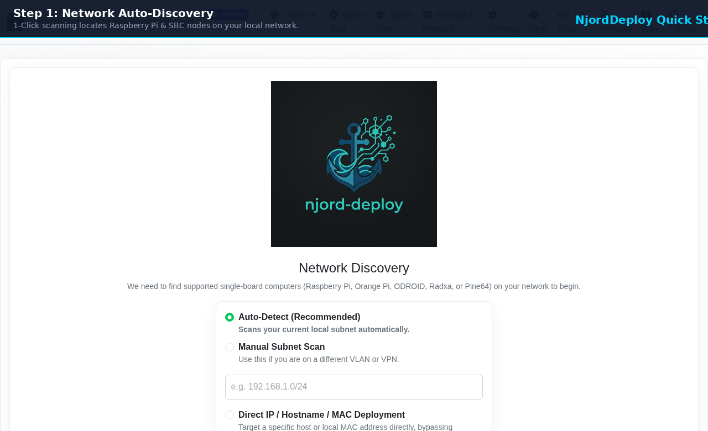
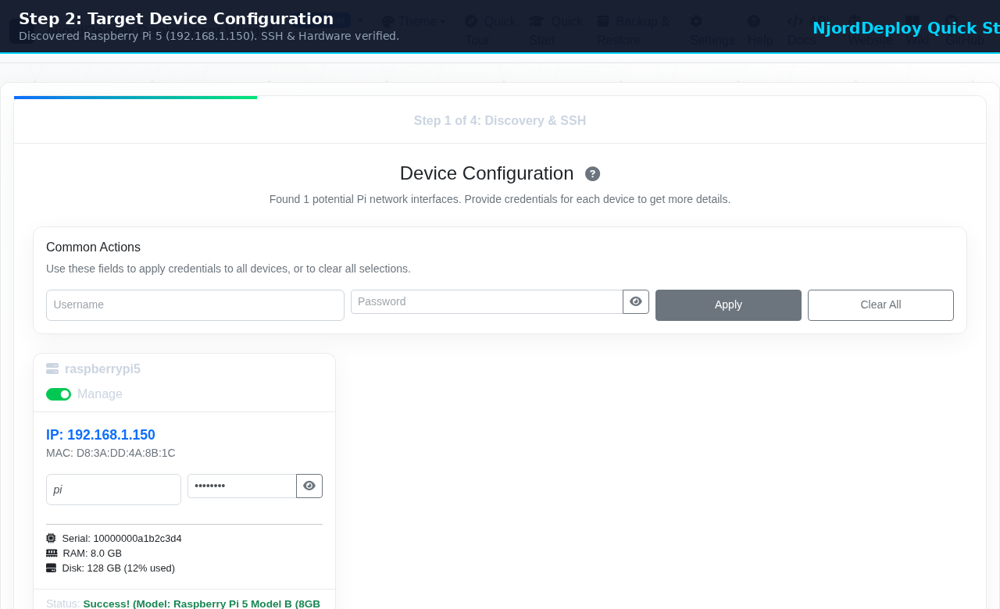
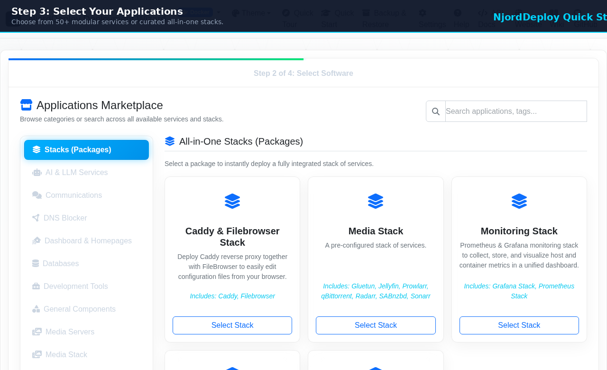
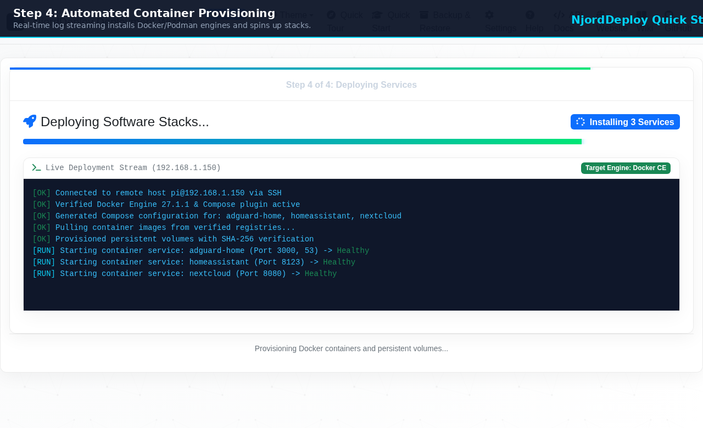
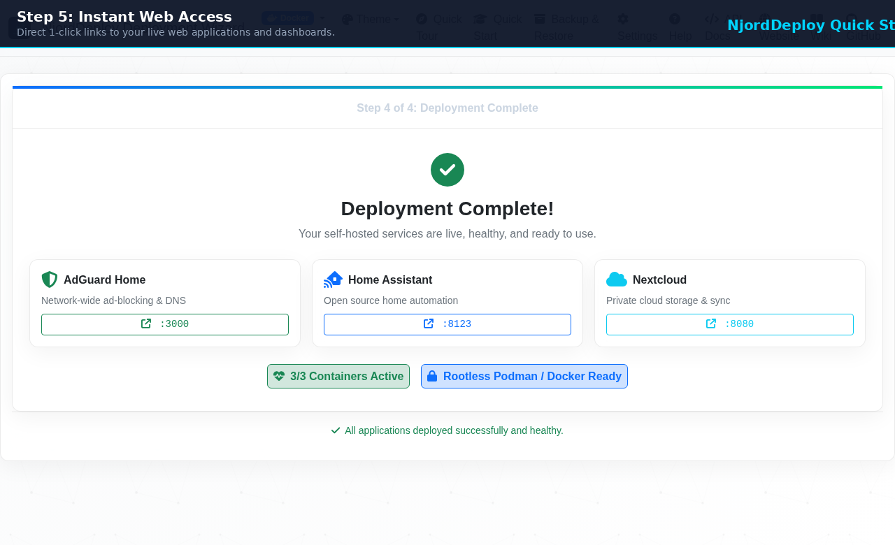

# 🚀 NjordDeploy Beginner's Guide (Quick Start for Dummies)

Welcome to **NjordDeploy**! If you just bought a Raspberry Pi (or have a spare mini-PC/server) and want to run your own private cloud, ad-blocker, or home automation system without wrestling with complex Linux terminal commands, you are in the right place.

This guide walks you through the entire process in **5 simple, visual steps**.

---

  
  
<em>The entire deployment workflow in 15 seconds: Scan, Select, Deploy, and Enjoy!</em>

---

## 📋 What You Need Before You Start

You only need **three simple things**:

1. **A Target Machine**: A Raspberry Pi 4/5 (or any mini-PC / Linux computer) running Raspberry Pi OS or Debian/Ubuntu, connected to your home Wi-Fi or router with an Ethernet cable.
2. **Your Daily Computer**: A Windows, macOS, or Linux laptop/desktop.
3. **5 to 10 Minutes**: That's it! You **do not** need to pre-install Docker, configure databases, or write YAML configuration files manually.

---

## 👣 The 5-Step Walkthrough

### Step 1: Download and Run NjordDeploy

1. Head to our [GitHub Releases Page](https://github.com/HenkVanHoek/njord-deploy/releases).
2. Download the `.zip` package for your operating system:
   * **Windows:** `NjordDeploy-Windows.zip`
   * **macOS:** `NjordDeploy-macOS.zip`
   * **Linux:** `NjordDeploy-Linux.zip`
3. Extract the folder and double-click **`NjordDeployConfigurator`** (or `.exe` on Windows).
4. Your web browser will automatically open to `http://localhost:5001`.

  

> [!TIP]
> **No installation required!** NjordDeploy runs as a standalone, portable application. It does not install background services on your laptop.

---

### Step 2: Discover Your Device

1. Leave the option set to **Auto-Detect (Recommended)**.
2. Click **"Begin Scan"**.
3. NjordDeploy will automatically find your Raspberry Pi on your local network.
4. Enter your Pi's username (usually `pi` or your custom user) and password, then click **"Connect & Get Details"**.
5. Once verified (green checkmark showing RAM and disk space), click **"Proceed"**.

  

---

### Step 3: Choose Your Software

NjordDeploy offers over 100+ curated applications. You can either select individual apps across categories or pick a **1-Click Turnkey Bundle / All-in-One Stack**:

#### 💼 MSP & Small Business Turnkey Bundles
* **💼 The Modern Sovereign Workplace:** Enterprise [Nextcloud](https://nextcloud.com/) Hub + MariaDB + Redis cache + automated database dumper + high-performance push notifications + [Vaultwarden](https://github.com/dani-garcia/vaultwarden) team password manager.
* **📄 Digital Archive & Document Compliance:** [Paperless-ngx](https://docs.paperless-ngx.com/) automated OCR document scanner + [Stirling-PDF](https://github.com/Stirling-Tools/Stirling-PDF) sovereign web PDF utility + [Actual Budget](https://actualbudget.org/) accounting + [NocoDB](https://nocodb.com/) smart database.
* **🚀 Agile Operations & Secure Chat:** [Vikunja](https://vikunja.io/) task management + [Focalboard](https://www.focalboard.com/) Kanban boards + [Gitea](https://about.gitea.com/) Git/CI-CD + [Conduit](https://conduit.rs/) lightweight Matrix chat + [Memos](https://usememos.com/) knowledge base.
* **📈 Observability & Privacy Analytics:** [Beszel](https://github.com/henrygd/beszel) host metrics + [Prometheus](https://prometheus.io/) + [Grafana](https://grafana.com/) dashboards + [Plausible](https://plausible.io/) cookie-less analytics + [Uptime Kuma](https://github.com/louislam/uptime-kuma) status monitors.

#### 🏠 Popular Homelab Stacks
* **🤖 Open WebUI & Ollama AI Studio:** [Ollama](https://ollama.com/) local LLMs + [Open WebUI](https://openwebui.com/) + [LiteLLM](https://github.com/BerriAI/litellm) gateway.
* **🎬 Media Streaming Suite:** [Jellyfin](https://jellyfin.org/) media server + [Radarr](https://radarr.video/) + [Sonarr](https://sonarr.tv/) + [Prowlarr](https://prowlarr.com/) + [Jellyseerr](https://github.com/Fallenbagel/jellyseerr) + [qBittorrent](https://www.qbittorrent.org/) + [Bazarr](https://www.bazarr.media/).
* **🏠 Sovereign Smart Home Hub:** [Home Assistant](https://www.home-assistant.io/) + [ESPHome](https://esphome.io/) + [Node-RED](https://nodered.org/) + [Scrypted](https://www.scrypted.app/).
* **🛡️ DNS & Privacy Shield:** [AdGuard Home](https://adguard.com/en/adguard-home/overview.html) DNS sinkhole + [Unbound](https://nlnetlabs.nl/projects/unbound/about/) recursive resolver.

  

Click on a bundle or individual services you want, then click **"Proceed to Configuration"**.

---

### Step 4: One-Click Automated Deployment

1. Review your chosen services and default ports (passwords and storage paths are automatically generated for you).
2. Click **"Deploy Services"**.
3. Sit back and watch the live deployment log. NjordDeploy will automatically:
   * Install the latest Docker/Podman container engine on your Pi if it isn't installed yet.
   * Download the official, verified container images.
   * Configure isolated storage volumes with cryptographic verification.
   * Start and health-check all services.

  

---

### Step 5: Start Using Your Services!

When deployment finishes, you will see a celebratory green **Deployment Complete!** screen.

Each installed service is displayed with a direct link and port (e.g. `http://192.168.1.150:3000` for AdGuard or `:8123` for Home Assistant). Click the button to open your new dashboard in a new tab!

  

---

## ❓ Frequently Asked Questions (FAQ) for Beginners

### Do I need to install Docker or Linux packages first?
**No.** If Docker Engine or Compose is missing from your target device, NjordDeploy installs and configures it automatically for you during Step 4.

### Can I install more apps later?
**Yes!** You can run NjordDeploy at any time to add new apps or update existing ones without losing your existing data.

### Where is my data saved?
All service data (photos, passwords, settings) is stored in standard persistent volumes on your Raspberry Pi (usually inside `/srv/docker/` or `/var/lib/docker/volumes/`). You can easily back them up using NjordDeploy's built-in **Backup & Restore** manager.

### What if something goes wrong?
NjordDeploy includes built-in **AI Failure Diagnostics**. If a port is occupied or a network issue occurs, it analyzes the log and explains in plain English what happened and how to fix it with 1 click.

---

## 📚 Where to Go Next?

* 📖 **[Full User & Network Setup Guide](USER_GUIDE.md)**: Deep dive into custom subnets, SSH keys, and Tailscale mesh networks.
* 🛠️ **[Supported Services Catalog](SUPPORTED_SERVICES.md)**: Explore all 100+ available self-hosted applications.
* 🏛️ **[System Architecture](ARCHITECTURE.md)**: Learn how NjordDeploy works under the hood.
