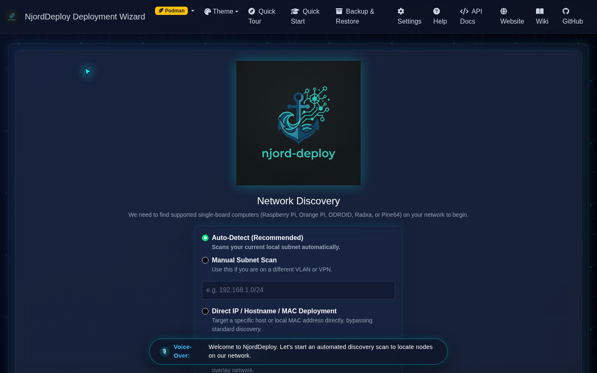
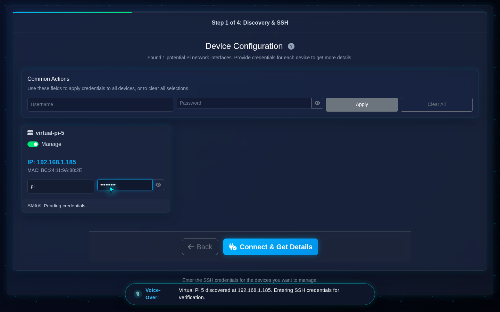
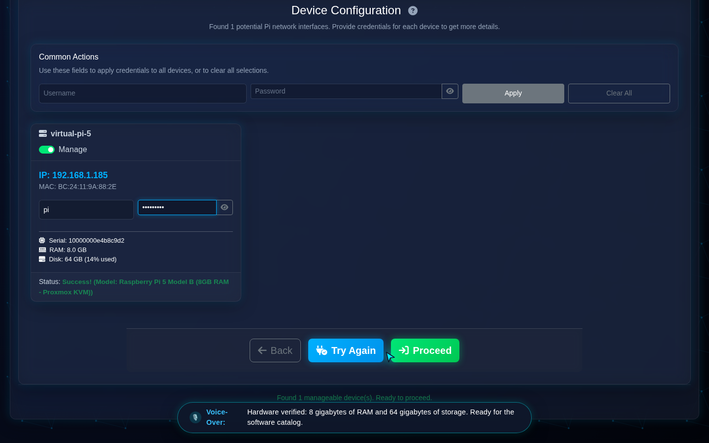
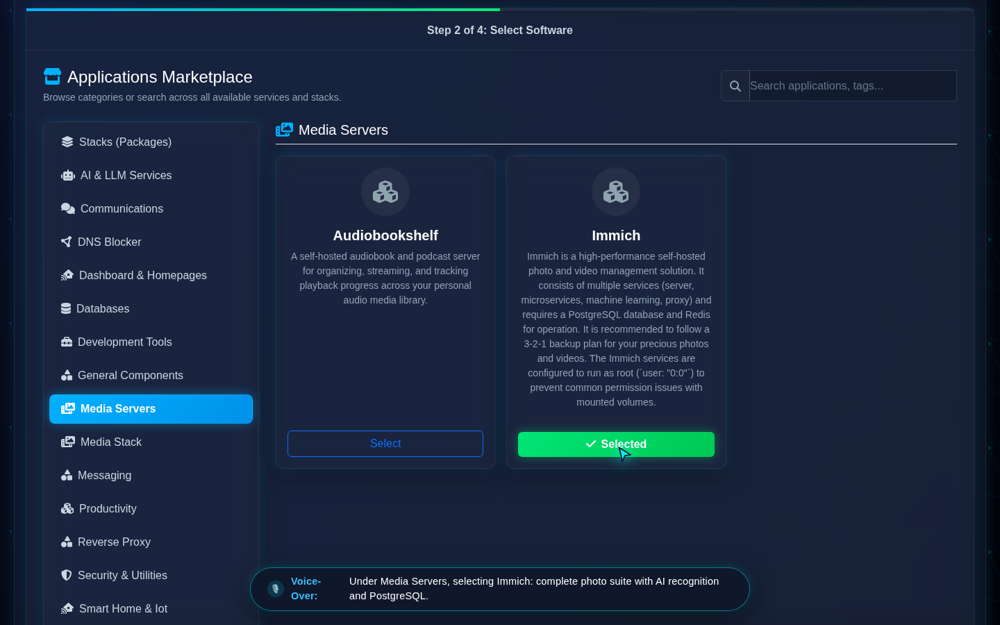
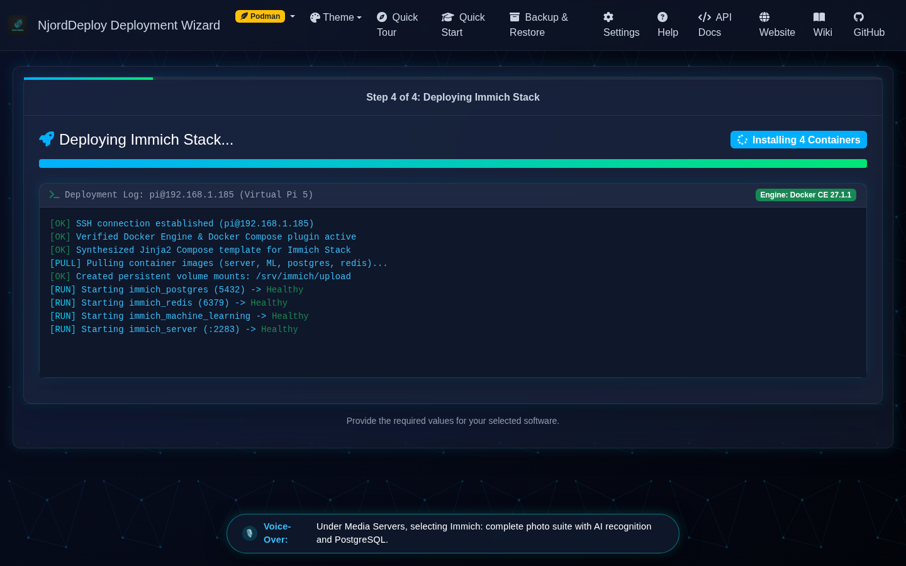
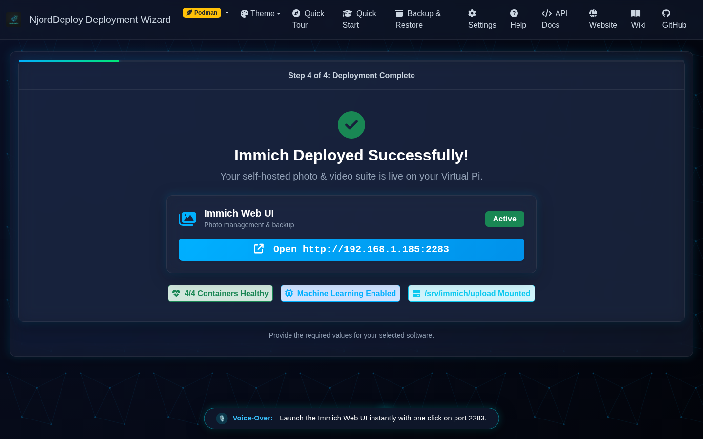

# Immich Video Walkthrough Storyboard & Audio-Driven Timing Guide

Dit storyboard documenteert de 6 scènes van de geautomatiseerde **Immich (Self-Hosted Photos & AI)** installatievideo op een Virtual Pi / Proxmox node binnen **NjordDeploy**.

Het script werkt met **Audio-Driven Pacing**: elke visuele scène wacht expliciet totdat de gesproken toelichting (`en-US-ChristopherNeural`) volledig is uitgesproken (inclusief rustbuffer) vóórdat er een klik of schermovergang plaatsvindt.

---

## 📊 Video Specificaties & Audio-Driven Tijdlijn

- **Resolutie:** 1440 × 900 (16:10 Full HD canvas)
- **Thema:** `Futuristic Dark` (vanaf frame 0 direct donker zonder flitsen)
- **Totale Lengte:** ~1 minuut en 28 seconden (88 sec)
- **Audio Voice-Over:** `en-US-ChristopherNeural` (+6% natuurlijke leessnelheid)
- **Pacing Architectuur:** Playwright synchroniseert wachttijden direct op basis van de vooraf gemeten audiocliplengtes.
- **Bestandslocaties Video:**
  - MP4 (H.264 + AAC 192k): [`docs/videos/immich-virtual-pi-deployment.mp4`](file:///home/hvhoek/PycharmProjects/njord-deploy/docs/videos/immich-virtual-pi-deployment.mp4) (3.19 MB)
  - WebM (VP8 + Opus 128k): [`docs/videos/immich-virtual-pi-deployment.webm`](file:///home/hvhoek/PycharmProjects/njord-deploy/docs/videos/immich-virtual-pi-deployment.webm) (6.90 MB)
- **Ondertitels:** [`docs/videos/immich-virtual-pi-deployment.en.vtt`](file:///home/hvhoek/PycharmProjects/njord-deploy/docs/videos/immich-virtual-pi-deployment.en.vtt) | [`docs/videos/immich-virtual-pi-deployment.en.srt`](file:///home/hvhoek/PycharmProjects/njord-deploy/docs/videos/immich-virtual-pi-deployment.en.srt)
- **Generatiescript:** [`scripts/generate_immich_install_video.py`](file:///home/hvhoek/PycharmProjects/njord-deploy/scripts/generate_immich_install_video.py)
- **Frame Audit Script:** [`scripts/audit_video_frames.py`](file:///home/hvhoek/PycharmProjects/njord-deploy/scripts/audit_video_frames.py)

```mermaid
gantt
    title Immich Walkthrough Audio-Driven Timeline (88s)
    dateFormat  ss
    axisFormat  %S s

    section 1. Discovery
    Intro & Scan Start (0:00 - 0:14)        :active, d1, 00, 14s
    section 2. Credentials
    Node Gevonden & Inloggen (0:14 - 0:31)  :d2, after d1, 17s
    section 3. Hardware
    Specs 8GB RAM & 64GB SSD (0:31 - 0:45)  :d3, after d2, 14s
    section 4. Catalogus
    Immich Stack Selectie (0:45 - 0:57)     :d4, after d3, 12s
    section 5. Deployment
    Live Stream & Containers (0:57 - 0:79)  :d5, after d4, 22s
    section 6. Web Access
    Succes & 1-Klik Launch (0:79 - 0:88)    :d6, after d5, 9s
```

---

## 🎬 Scène-voor-Scène Analyse & Regie

### Scène 1: Startscherm & Netwerk Auto-Discovery
**Tijdstip:** `0:00 – 0:14` | **Spraak:** `0:00.20 – 0:07.06` (6.86s)



#### Regie & Choreografie
1. Startscherm in Futuristic Dark opent rustig.
2. Spraak start direct met de introductie over netwerkdetectie.
3. De video wacht de volledige 6.86s spraak + 1.2s rustbuffer af.
4. **Pas op seconde 8.5** beweegt de cursor naar **"Begin Discovery Scan"** en klikt.

---

### Scène 2: Node Selectie & SSH Credentials
**Tijdstip:** `0:14 – 0:31` | **Spraak:** `0:14.36 – 0:24.18` (9.82s)



#### Regie & Choreografie
1. De netwerkscan voltooit en de kaart van `virtual-pi-5 (192.168.1.185)` centreert in beeld.
2. **Pas wanneer de Pi-kaart zichtbaar is (14.36s)** start de voice-over: *"Virtual Pi 5 discovered at 192.168.1.185..."*.
3. Inloggegevens (`pi` / `raspberry`) worden rustig ingevoerd.
4. De video **wacht expliciet totdat de voice-over klaar is (+ 1.5s pauze)**.
5. **Pas op seconde 26.5** klikt de cursor op **"Connect & Get Details"**.

---

### Scène 3: Hardware Verificatie (8 GB RAM & 64 GB SSD)
**Tijdstip:** `0:31 – 0:45` | **Spraak:** `0:31.30 – 0:39.32` (8.02s)



#### Regie & Choreografie
1. SSH-inspectie voltooit en de hardwarekaart verschijnt met `RAM: 8.0 GB` en `Disk: 64 GB`.
2. **Pas wanneer de kaart zichtbaar is (31.30s)** start de gesproken tekst: *"Hardware verified: 8 gigabytes of RAM and 64 gigabytes of storage..."*.
3. De video blijft ruim **10 seconden** rustig op deze kaart staan.
4. **Pas op seconde 41.5** klikt de cursor op **"Proceed"**.

---

### Scène 4: Immich Software Selectie (Media Servers)
**Tijdstip:** `0:45 – 0:57` | **Spraak:** `0:45.84 – 0:52.68` (6.84s)



#### Regie & Choreografie
1. Softwarecatalogus laadt op seconde 45.0.
2. Voice-over introduceert Immich en PostgreSQL.
3. Cursor selecteert Media Servers en klikt op Immich (knop verandert in groen `✓ Selected`).
4. De video pauzeert totdat de toelichting klaar is (+ 2.0s buffer).
5. **Pas op seconde 54.5** klikt de cursor op **"Deploy Immich Stack"**.

---

### Scène 5: Live Streaming Deployment & Container Health
**Tijdstip:** `0:57 – 0:79` | **Spraak:** `0:70.69 – 0:77.31` (6.62s)



#### Regie & Choreografie
1. Live deployment terminal opent en streamt 8 voortgangsregels (57s tot 69s).
2. Voortgangsbalk bereikt **100% (Groen)** en alle 4 containers worden **Healthy**.
3. **PAS NADAT alle containers geverifieerd zijn (70.69s)** start de voice-over: *"Deployment complete! All four microservices are deployed via Docker and verified healthy."*
4. Rustige pauze op de voltooide terminal terwijl de stem spreekt.

---

### Scène 6: Succes & 1-Klik Launch Web UI
**Tijdstip:** `0:79 – 0:88` | **Spraak:** `0:79.48 – 0:84.86` (5.38s)



#### Regie & Choreografie
1. Succes-scherm verschijnt met groene checkmark en 3 container-badges.
2. Voice-over licht de 1-klik webbrowser lancering op poort 2283 toe.
3. Cursor pulseert groen op **`Open http://192.168.1.185:2283`**.
4. Rustige outro tot einde (88s).
