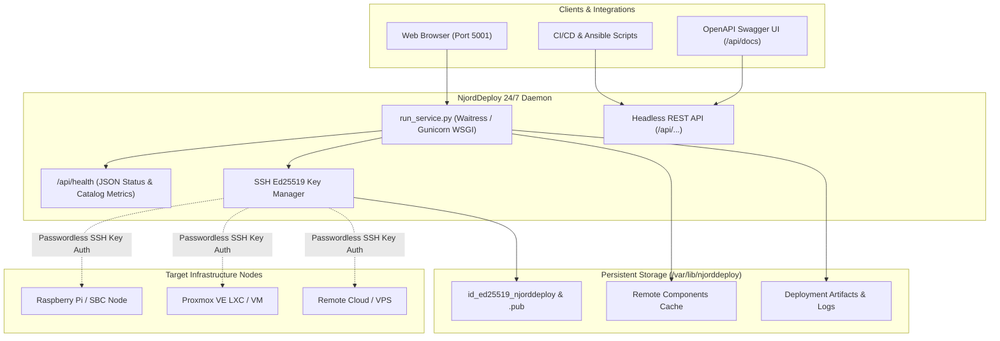

# NjordDeploy 24/7 Persistent Self-Hosted Service Guide

This guide describes how to run **NjordDeploy** as a persistent, 24/7 self-hosted service on your private server, Raspberry Pi, mini-PC, or Proxmox KVM Virtual Machine.

---

## 1. Overview & Architecture

NjordDeploy supports two primary operating modes:

1. **Standalone Desktop Mode:** On-demand desktop GUI / CLI tool running on your local workstation.
2. **24/7 Self-Hosted Daemon Mode:** Persistent background daemon exposing the Web Configurator UI, Component Editor, and Headless REST API continuously across your home or enterprise network.



---

## 2. Option 1: Docker Compose Deployment (1-Click)

The fastest and most isolated way to host NjordDeploy 24/7 is using Docker Compose.

### Step 1: Create `docker-compose.yml`

Create a directory on your server and add the following `docker-compose.yml`:

```yaml
services:
  njorddeploy:
    build:
      context: .
      dockerfile: Dockerfile
    image: henkvanhoek/njorddeploy:latest
    container_name: njorddeploy
    restart: unless-stopped
    ports:
      - "5001:5001"
    environment:
      - NJORD_SERVER_MODE=true
      - NJORD_HOST=0.0.0.0
      - NJORD_PORT=5001
      - NJORD_DATA_DIR=/var/lib/njorddeploy
      - NJORD_SSH_KEY_PATH=/var/lib/njorddeploy/id_ed25519_njorddeploy
      - NJORD_SECRET_KEY=change-this-to-a-secure-random-token
      - TZ=Europe/Amsterdam
    volumes:
      - njord_data:/var/lib/njorddeploy
    healthcheck:
      test: ["CMD-SHELL", "curl -f http://localhost:5001/api/health || exit 1"]
      interval: 30s
      timeout: 5s
      retries: 3
      start_period: 10s
    stop_grace_period: 15s

volumes:
  njord_data:
    name: njorddeploy_data
```

### Step 2: Start the Container

```bash
docker compose up -d
```

### Step 3: Verify Container Health

```bash
# Check container status and health
docker compose ps

# Check logs
docker compose logs -f njorddeploy

# Probe health endpoint
curl -s http://localhost:5001/api/health | jq .
```

---

## 3. Option 2: Native Linux Systemd Service

For direct bare-metal hosting on Debian, Ubuntu, Raspberry Pi OS, or dedicated Proxmox Linux VMs.

### Step 1: Clone Repository & Prepare Environment

```bash
cd /opt
sudo git clone https://github.com/HenkVanHoek/njord-deploy.git njorddeploy
sudo chown -R $USER:$USER /opt/njorddeploy
cd /opt/njorddeploy

# Create and populate Python virtual environment
python3 -m venv .venv
source .venv/bin/activate
pip install -U pip setuptools wheel
pip install .
```

### Step 2: Install and Start Systemd Service

Use the built-in automated installer script:

```bash
sudo ./scripts/install_systemd_service.sh install
```

The installer will:
1. Create `/var/lib/njorddeploy` persistent data directory with correct permissions.
2. Generate the environment configuration at `/etc/default/njorddeploy`.
3. Create `/etc/systemd/system/njorddeploy.service`.
4. Enable and start the service daemon.
5. Verify health status on `http://127.0.0.1:5001/api/health`.

### Step 3: Manage the Service

```bash
# View service status and health report
sudo ./scripts/install_systemd_service.sh status

# Follow real-time logs
sudo ./scripts/install_systemd_service.sh logs

# Restart service
sudo ./scripts/install_systemd_service.sh restart

# Stop service
sudo ./scripts/install_systemd_service.sh stop

# Uninstall service
sudo ./scripts/install_systemd_service.sh uninstall
```

---

## 4. SSH Key Management & Target Authentication

NjordDeploy automatically generates a persistent **Ed25519 SSH Key Pair** upon first launch in the persistent data directory:

- **Private Key:** `/var/lib/njorddeploy/id_ed25519_njorddeploy` (mode `0600`)
- **Public Key:** `/var/lib/njorddeploy/id_ed25519_njorddeploy.pub` (mode `0644`)

### Authorizing NjordDeploy on Remote Fleet Nodes

To allow NjordDeploy to deploy stacks and scan target nodes without interactive password entry:

```bash
# Option A: View public key from server
cat /var/lib/njorddeploy/id_ed25519_njorddeploy.pub

# Option B: Copy public key to target node (from the NjordDeploy server)
ssh-copy-id -i /var/lib/njorddeploy/id_ed25519_njorddeploy.pub <username>@<target-ip>

# Option C: In Docker Compose
docker compose exec njorddeploy cat /var/lib/njorddeploy/id_ed25519_njorddeploy.pub
```

---

## 5. Configuration & Environment Variables

| Variable | Default | Description |
| :--- | :--- | :--- |
| `NJORD_SERVER_MODE` | `false` (desktop), `true` (service) | Enables 24/7 persistent service daemon mode. |
| `NJORD_HOST` | `0.0.0.0` | Host IP interface to bind WSGI listener. |
| `NJORD_PORT` | `5001` | TCP port for Web UI & REST API. |
| `NJORD_DATA_DIR` | `/var/lib/njorddeploy` | Persistent data directory for keys, caches, and outputs. |
| `NJORD_SSH_KEY_PATH` | `${NJORD_DATA_DIR}/id_ed25519_njorddeploy` | Path to persistent Ed25519 SSH private key. |
| `NJORD_SECRET_KEY` | *(Auto-generated)* | Secret key for Flask session cookie encryption. |
| `NJORD_THREADS` | `8` | Number of worker threads for Waitress WSGI. |
| `WSGI_SERVER` | `waitress` | WSGI server implementation (`waitress` or `gunicorn`). |

---

## 6. Service Healthcheck & Headless REST API

### Health Endpoint

Query the live health status:

```bash
curl -s http://<server-ip>:5001/api/health
```

Example JSON response:

```json
{
  "status": "ok",
  "version": "0.6.0",
  "mode": "service",
  "services_catalog": 85,
  "timestamp": "2026-08-29T14:40:00+00:00"
}
```

### Interactive Swagger UI & OpenAPI Specification

- **Interactive API Documentation:** `http://<server-ip>:5001/api/docs`
- **OpenAPI 3.0.3 Schema JSON:** `http://<server-ip>:5001/api/openapi.json`

---

## 7. Reverse Proxy Integration (Caddy Example)

To serve NjordDeploy securely with HTTPS and Tailscale / Headscale VPN:

```caddyfile
njord.local.yourdomain.com {
    reverse_proxy 127.0.0.1:5001 {
        header_up Host {host}
        header_up X-Real-IP {remote_host}
        header_up X-Forwarded-For {remote_host}
        header_up X-Forwarded-Proto {scheme}
    }
}
```
