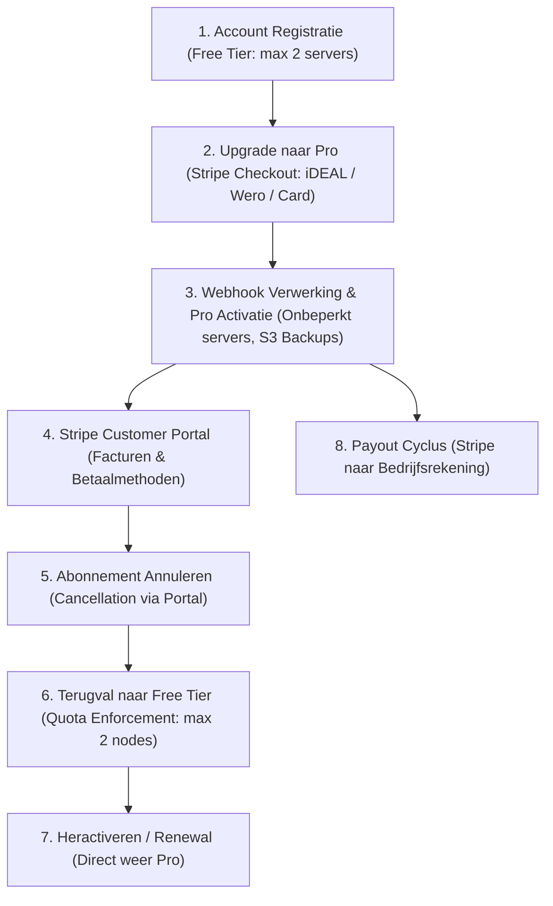

# 💳 Stripe Billing & Subscription Lifecycle Test Plan

Dit testplan beschrijft de complete levenscyclus voor abonnementsbeheer, betalingen, self-service klantportaal, opzeggingen, heractivaties en uitbetalingen in **NjordDeploy SaaS**.

---

## 🏗️ Architectuur & Levenscyclus Overzicht



---

## 📋 Testmatrix & Scenario's

| Test ID | Scenario | Trigger / Actie | Verwacht Resultaat | Status |
| :--- | :--- | :--- | :--- | :---: |
| **ST-01** | **Initial Checkout & Pro Upgrade** | Upgrade Monthly (€5/mnd) via Wero / iDEAL / Card | Redirect met `stripe_session_id`, Pro Celebration Modal, status `pro` in database | ✅ **PASS** |
| **ST-02** | **Stripe Customer Portal & Facturen** | Klik op *Open Stripe Customer Portal* | Stripe-hosted portal opent, factuur in te zien en te downloaden als PDF | ⏳ **Klaar voor test** |
| **ST-03** | **Betaalmethode / Gegevens Wijzigen** | Wijzig betaalmethode of factuuradres in portal | Stripe slaat gegevens veilig op, toekomstige facturen bevatten nieuwe gegevens | ⏳ **Klaar voor test** |
| **ST-04** | **Abonnement Annuleren (Opzeggen)** | Klik op *Abonnement annuleren* in portal | Webhook `customer.subscription.deleted`/`updated`, account schakelt terug naar `free` | ⏳ **Klaar voor test** |
| **ST-05** | **Quota Terugval Verificatie** | Probeer 3e server toe te voegen na opzegging | API weigert met `403 Forbidden` (`upgrade_required: true`) | ⏳ **Klaar voor test** |
| **ST-06** | **Abonnement Heractiveren** | Klik op *Abonnement hernieuwen* of *Upgrade to Pro* | Webhook verwerkt reactivatie, plan springt direct weer op `pro` | ⏳ **Klaar voor test** |
| **ST-07** | **Uitbetalingscyclus (Payout)** | Controleer Stripe Payouts Dashboard | Saldo gereserveerd en automatisch overgeboekt naar geregistreerde zakelijke rekening | ⏳ **Klaar voor test** |

---

## 🔍 Gedetailleerde Stappenplannen

### Test ST-02: Stripe Customer Portal & Factuur Download
1. Log in op de gewenste NjordDeploy instantie met je testaccount.
2. Klik in de navigatiebalk op **Billing** of navigeer naar **Settings > Subscription & Billing**.
3. Klik op **Open Stripe Customer Portal** (roept `POST /api/billing/portal` aan).
4. **Verificatiepunten:**
    * [ ] Opent het officiële Stripe Customer Portal (`https://billing.stripe.com/p/session/...`) zonder foutmeldingen?
    * [ ] Is de transactie zichtbaar onder **Factuurgeschiedenis**?
    * [ ] Kan de officiële PDF-factuur worden gedownload?
    * [ ] Bevat de factuur de juiste bedrijfs- en factuurgegevens?
5. Klik in het portal op **← Terug naar NjordDeploy**.
6. **Verificatiepunt:**
    * [ ] Keert de browser netjes terug naar `/?billing=portal_return` en schoont de URL automatisch op?

---

### Test ST-03: Betaalmethode & Bedrijfsgegevens Beheren
1. Open het Stripe Customer Portal via NjordDeploy.
2. Voeg onder **Betaalmethode** een alternatieve methode toe (bijv. SEPA Incasso of Creditcard).
3. Werk onder **Factuurgegevens** eventueel het btw-nummer of adres bij.
4. **Verificatiepunten:**
    * [ ] Wordt de gewijzigde betaalmethode als standaard gemarkeerd in Stripe?
    * [ ] Blijft het account in NjordDeploy zonder onderbreking actief op `pro`?

---

### Test ST-04: Abonnement Annuleren (Cancellation)
1. Open het Stripe Customer Portal via NjordDeploy.
2. Klik op **Abonnement annuleren**.
3. Bevestig de annulering in Stripe.
4. **Verificatiepunten:**
    * [ ] Stripe stuurt de webhook `customer.subscription.deleted` (of `customer.subscription.updated` met `cancel_at_period_end`).
    * [ ] In de database (`njord_saas.db`) wordt het plan van de gebruiker aangepast naar `free`.
    * [ ] In de UI verandert de navigatiebalkbadge van `PRO` naar de knop **Upgrade to Pro**.

---

### Test ST-05: Quota & Entitlement Terugval
1. Log in met het geannuleerde account (`plan = 'free'`).
2. Voeg 2 testservers toe (toegestaan binnen Free tier).
3. Probeer een 3e server toe te voegen via `POST /api/servers/add`.
4. **Verificatiepunten:**
    * [ ] Het toevoegen van de 3e server wordt geblokkeerd met `HTTP 403 Forbidden`.
    * [ ] De JSON-response bevat: `{"upgrade_required": true, "error": "Server limit reached for Free plan (max 2). Upgrade to Pro for unlimited servers."}`.

---

### Test ST-06: Abonnement Heractiveren (Renewal / Reactivation)
1. Log in met het account en klik in de navigatiebalk op **Upgrade to Pro** (of klik in het Customer Portal op **Abonnement hervatten**).
2. Voltooi de upgrade.
3. **Verificatiepunten:**
    * [ ] Stripe stuurt `checkout.session.completed` of `customer.subscription.updated` (`status: active`).
    * [ ] De database werkt het account direct bij naar `plan = 'pro'`.
    * [ ] De **Pro Success Celebration Modal** verschijnt in beeld.
    * [ ] De blokkade op het toevoegen van servers is direct opgeheven.

---

### Test ST-07: Stripe Uitbetalingscyclus (Payout Monitoring)
1. Log in op het Stripe Dashboard onder **Balans & Uitbetalingen**.
2. **Verificatiepunten:**
    * [ ] Het bedrag (minus Stripe verwerkingskosten) staat gereserveerd.
    * [ ] De geplande uitbetalingsdatum naar de zakelijke bankrekening staat vermeld.
    * [ ] Na de uitbetalingstermijn (standaard 2-3 werkdagen) staat de bijschrijving correct op het zakelijke bankafschrift.

---

## 🛠️ Diagnostische Commando's voor Beheerders (Generiek)

### 1. Gebruikersstatus controleren in de SQLite database:
```bash
ssh <user>@<server-ip> "python3 -c \"
import sqlite3
conn = sqlite3.connect('/path/to/njord_saas.db')
cur = conn.cursor()
cur.execute('SELECT id, username, email, plan, stripe_customer_id, stripe_subscription_id, updated_at FROM users WHERE username = \\'<test_username>\\'')
print(cur.fetchone())
\""
```

### 2. Live Webhook logs monitoren:
```bash
ssh <user>@<server-ip> "journalctl -u njorddeploy-configurator.service -f --no-pager"
```

### 3. Stripe Webhook endpoints & status controleren via API:
```bash
python3 -c "
import os, dotenv, stripe
dotenv.load_dotenv()
stripe.api_key = os.getenv('STRIPE_SECRET_KEY')
for wh in stripe.WebhookEndpoint.list().data:
    print(f'Webhook {wh.id}: {wh.url} ({wh.status})')
"
```
