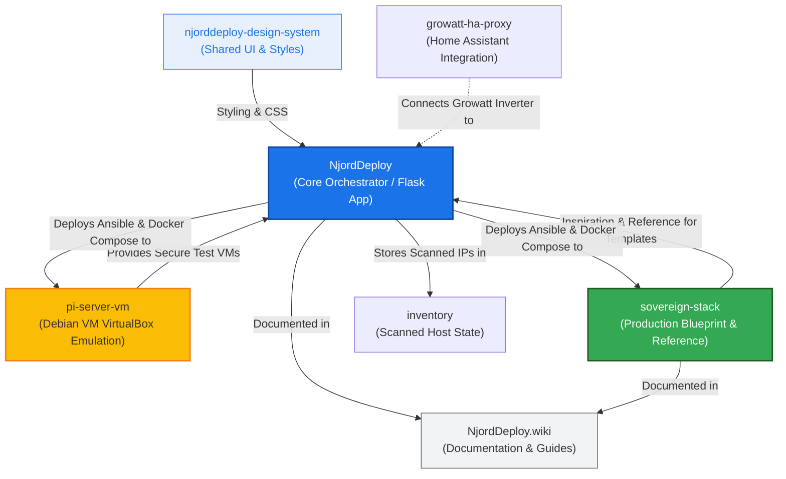

# NjordDeploy Ecosystem Relationship Map

This document describes the relationships, roles, and interactions between the various projects located in the main directory (`/home/hvhoek/PycharmProjects`). Together, these projects form the **NjordDeploy** ecosystem, ranging from UI styles to testing environments and production blueprints.

---

## 🗺️ Architecture & Relationship Diagram

The diagram below visualizes how the different projects and directories are connected and what role they play in the development, testing, and production lifecycle.

---

## 📂 Project Descriptions and Synergy

### 1. [NjordDeploy](file:///home/hvhoek/PycharmProjects/NjordDeploy) (Core Orchestrator)
* **Role:** The main Flask application consisting of the **Configurator** (for end-users) and the **Component Editor** (for developers).
* **Function:** Discovers devices on the local network via `nmap`, allows the user to select modular Docker services, and deploys them via SSH to the target machine (a Raspberry Pi or a Debian VM).
* **Relationships:**
  * Uses CSS tokens and styles from [njorddeploy-design-system](file:///home/hvhoek/PycharmProjects/njorddeploy-design-system).
  * Deploys configurations to VirtualBox VMs created by [pi-server-vm](file:///home/hvhoek/PycharmProjects/pi-server-vm) during test phases.
  * Productizes the manual configurations and concepts from [sovereign-stack](file:///home/hvhoek/PycharmProjects/sovereign-stack) into reusable `component_templates`.

### 2. [pi-server-vm](file:///home/hvhoek/PycharmProjects/pi-server-vm) (Test & Emulation Environment)
* **Role:** Scripting and tools to automate the creation and cloning of minimal Debian VMs in Oracle VirtualBox.
* **Function:** Emulates a Raspberry Pi network environment on a local x86 workstation.
* **Relationship to the ecosystem:**
  * Serves as the **testbed environment** for [NjordDeploy](file:///home/hvhoek/PycharmProjects/NjordDeploy). Instead of testing deployments directly on a physical Raspberry Pi (which risks wearing out the SD card/NVMe or disrupting home services), developers can clone a clean VM with a single command and run trial deployments.

### 3. [njorddeploy-design-system](file:///home/hvhoek/PycharmProjects/njorddeploy-design-system) (Design System)
* **Role:** Shared visual assets and CSS stylesheets.
* **Function:** Provides a `style_guide.html` and central design tokens.
* **Relationship to the ecosystem:**
  * Ensures a consistent and modern UI/UX across all web interfaces, particularly the configurator and editor apps in [NjordDeploy](file:///home/hvhoek/PycharmProjects/NjordDeploy).

### 4. [sovereign-stack](file:///home/hvhoek/PycharmProjects/sovereign-stack) (Production Blueprint & Reference)
* **Role:** The proven, resilient production environment running on a physical Raspberry Pi 5.
* **Function:** Contains a complete Docker stack (Nextcloud, NetBox, Grafana/Loki monitoring) with a strict 3-2-1 encrypted backup strategy and intrusion prevention (Fail2ban).
* **Relationship to the ecosystem:**
  * Serves as the **production baseline and source of inspiration**. Services that run stably in the `sovereign-stack` are converted into modular `component_templates` in [NjordDeploy](file:///home/hvhoek/PycharmProjects/NjordDeploy), making them easily deployable for other users via the web browser.

### 5. [NjordDeploy.wiki](file:///home/hvhoek/PycharmProjects/NjordDeploy.wiki) (Knowledge Base)
* **Role:** Shared developer and user documentation.
* **Function:** Contains guides on network configuration, port forwarding, reverse proxies, and the overall architectural mental model.
* **Relationship to the ecosystem:**
  * Documents the architectural decisions and deployment strategies of both the installer and the underlying services.

### 6. [inventory](file:///home/hvhoek/PycharmProjects/inventory) (Deployment State)
* **Role:** Temporary storage for scanned hosts (`hosts.json`).
* **Function:** Keeps track of IP addresses discovered on the network or selected for installation by the configurator.

### 7. [growatt-ha-proxy](file:///home/hvhoek/PycharmProjects/growatt-ha-proxy) (Integration Proxy)
* **Role:** Standalone proxy forwarding Growatt solar inverter data to Home Assistant.
* **Relationship to the ecosystem:**
  * While independent, Home Assistant is a core component installable via [NjordDeploy](file:///home/hvhoek/PycharmProjects/NjordDeploy) and [sovereign-stack](file:///home/hvhoek/PycharmProjects/sovereign-stack). This proxy integrates directly with that Home Assistant instance.

---

> [!NOTE]
> This document can be updated as new components (such as additional proxy services or monitoring tools) are added to the main directory.
